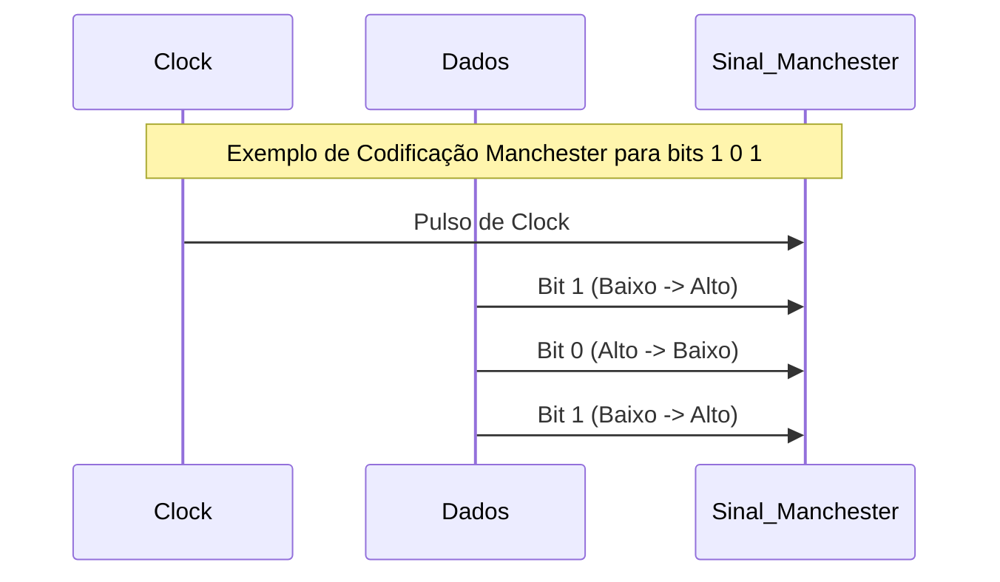

# ⚡ Camada Física

## 1. Visão Geral
A camada física é a base de qualquer rede, responsável pela transmissão de **bits brutos** através de um canal de comunicação. Ela lida com as propriedades mecânicas, elétricas, funcionais e procedurais para ativar, manter e desativar conexões físicas.

### 1.1. Funções Principais
- **Codificação de Bits:** Transformar bits (0s e 1s) em sinais (elétricos, ópticos ou ondas de rádio).
- **Sincronização:** Garantir que transmissor e receptor operem no mesmo clock.
- **Multiplexação:** Combinar múltiplos sinais em um único meio (FDM, TDM).

---

## 2. Teoremas Fundamentais da Comunicação

A capacidade de transmissão de um canal é limitada por leis físicas.

### 2.1. Teorema de Nyquist (Canal sem Ruído)
Define a taxa máxima de dados para um canal livre de ruído com largura de banda limitada.

$$ C_{max} = 2 \cdot B \cdot \log_2(V) \text{ bps} $$

- $C_{max}$: Capacidade máxima (bps)
- $B$: Largura de banda (Hz)
- $V$: Número de níveis discretos do sinal

### 2.2. Teorema de Shannon (Canal com Ruído)
Define o limite teórico máximo para um canal com ruído aleatório (Gaussiano).

$$ C = B \cdot \log_2(1 + SNR) $$

- $SNR$: Relação Sinal-Ruído (Signal-to-Noise Ratio), onde $SNR = \frac{S}{N}$ (potência do sinal / potência do ruído).
- Geralmente expresso em decibéis (dB): $SNR_{dB} = 10 \log_{10}(SNR)$.

---

## 3. Meios de Transmissão

### 3.1. Par Trançado (Twisted Pair)
Fios de cobre trançados para cancelar interferência eletromagnética (EMI).
- **UTP (Unshielded):** Sem blindagem, mais comum e barato.
- **STP (Shielded):** Com blindagem, para ambientes com muito ruído.

### 3.2. Fibra Óptica
Transmite pulsos de luz. Imune a EMI, menor atenuação, altíssima largura de banda.
- **Monomodo (Single-mode):** Núcleo fino (~9µm), luz laser, longas distâncias (km a centenas de km).
- **Multimodo (Multi-mode):** Núcleo mais largo (~50-62.5µm), luz LED, curtas distâncias (predios, data centers).

### 3.3. Sem Fio (Wireless)
- **Ondas de Rádio:** Omnidirecionais, atravessam obstáculos (ex: Wi-Fi).
- **Micro-ondas:** Direcionais, requerem visada direta (ex: enlaces ponto-a-ponto).
- **Infravermelho:** Curta distância, não atravessa paredes.

---

## 4. Padrões Ethernet (IEEE 802.3)

Tabela resumida dos padrões mais comuns de Ethernet na camada física.

| Padrão | Nome Comum | Velocidade | Meio Físico | Distância Máx. | Codificação |
| :--- | :--- | :--- | :--- | :--- | :--- |
| **802.3i** | 10BASE-T | 10 Mbps | UTP Cat 3+ | 100 m | Manchester |
| **802.3u** | 100BASE-TX | 100 Mbps | UTP Cat 5+ | 100 m | 4B/5B + MLT-3 |
| **802.3ab** | 1000BASE-T | 1 Gbps | UTP Cat 5e+ | 100 m | PAM-5 |
| **802.3an** | 10GBASE-T | 10 Gbps | UTP Cat 6a | 100 m | DSQ128 |
| **802.3z** | 1000BASE-SX | 1 Gbps | Fibra Multimodo | ~550 m | 8B/10B |
| **802.3z** | 1000BASE-LX | 1 Gbps | Fibra Mono/Multi | 5 km / 550 m | 8B/10B |
| **802.3ae** | 10GBASE-LR | 10 Gbps | Fibra Monomodo | 10 km | 64B/66B |

---

## 5. Codificação de Linha

Como os bits são representados no fio.

### 5.1. NRZ (Non-Return to Zero)
- 1 = Tensão alta
- 0 = Tensão baixa
- **Problema:** Perda de sincronismo em longas sequências de 0s ou 1s.

### 5.2. Manchester
- O bit é representado por uma transição no meio do intervalo.
- 1 = Transição Baixo-Alto
- 0 = Transição Alto-Baixo
- **Vantagem:** Auto-sincronizável (clock embutido).
- **Desvantagem:** Requer o dobro da largura de banda.

---

## 6. Referências
- **IEEE 802.3 Standard:** Ethernet Physical Layer specifications.
- **Shannon, C. E.:** "A Mathematical Theory of Communication".
