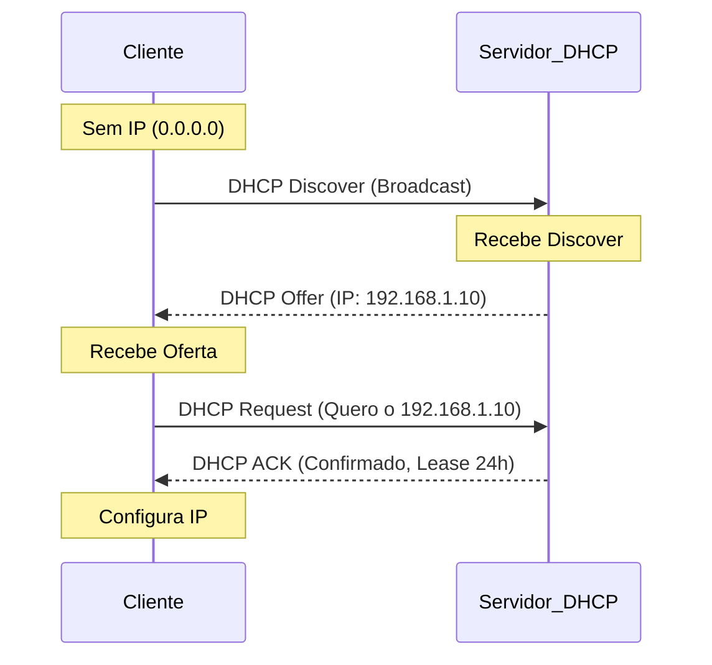

# 🧭 DHCP (Dynamic Host Configuration Protocol)

## 1. Visão Geral
O DHCP (RFC 2131) é um protocolo cliente-servidor que fornece automaticamente um host IP com seu endereço IP e outras informações de configuração relacionadas, como a máscara de sub-rede e o gateway padrão.

---

## 2. Processo DORA
O processo de obtenção de um IP envolve 4 passos principais (DORA):

1.  **Discover:** O cliente transmite uma mensagem em broadcast (`255.255.255.255`) procurando por servidores DHCP.
2.  **Offer:** Servidores DHCP que recebem a mensagem respondem com uma oferta de IP.
3.  **Request:** O cliente escolhe uma oferta e solicita formalmente o uso daquele IP.
4.  **Acknowledge (ACK):** O servidor confirma a concessão (lease) e envia os parâmetros finais.

---

## 3. Parâmetros Fornecidos
Além do IP, o DHCP fornece:
- **Máscara de Sub-rede:** Define o tamanho da rede.
- **Gateway Padrão (Router):** Para onde enviar pacotes fora da rede local.
- **Servidores DNS:** Para resolução de nomes.
- **Tempo de Concessão (Lease Time):** Tempo que o cliente pode usar o IP antes de renovar.

---

## 4. Renovação
Quando o tempo de concessão atinge 50% (T1), o cliente tenta renovar o IP diretamente com o servidor que o concedeu (Unicast). Se falhar, em 87.5% (T2) ele tenta em Broadcast.

---

## 5. Referências
- **RFC 2131:** Dynamic Host Configuration Protocol.
