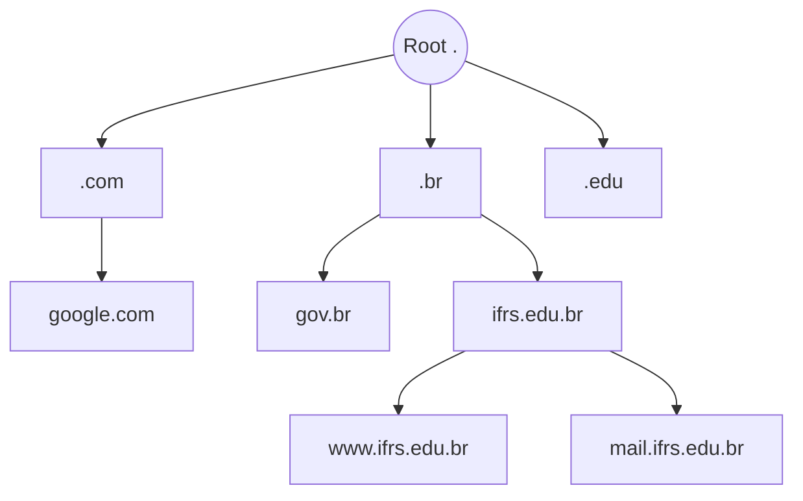

# 🌐 DNS (Domain Name System)

## 1. Visão Geral
O DNS (RFC 1035) é um banco de dados distribuído e hierárquico que traduz nomes de host legíveis por humanos (ex: `www.google.com`) em endereços IP (ex: `142.250.74.68`).

---

## 2. Hierarquia do DNS

O espaço de nomes DNS é dividido em zonas gerenciadas de forma independente.

1.  **Servidores Raiz (Root Servers):** O topo da hierarquia. Existem 13 identidades lógicas (A-M) replicadas mundialmente.
2.  **TLD (Top-Level Domain):** Domínios de topo (`.com`, `.org`, `.br`).
3.  **Autoritativos:** Servidores que detêm os registros finais de um domínio específico (ex: servidor DNS do Google).

---

## 3. Tipos de Registros (Resource Records)

| Tipo | Descrição | Exemplo |
| :--- | :--- | :--- |
| **A** | Endereço IPv4 | `google.com -> 142.250.74.68` |
| **AAAA** | Endereço IPv6 | `google.com -> 2001:4860:4860::8888` |
| **CNAME** | Canonical Name (Alias) | `www.google.com -> google.com` |
| **MX** | Mail Exchange (Email) | `google.com -> aspmx.l.google.com` |
| **NS** | Name Server (Autoridade) | `google.com -> ns1.google.com` |
| **TXT** | Texto (SPF, Verificação) | `v=spf1 include:_spf.google.com ~all` |

---

## 4. Resolução de Nomes (Iterativa vs. Recursiva)
- **Recursiva:** O cliente pede ao servidor local, que faz todo o trabalho de "caçar" a resposta e devolve o IP final.
- **Iterativa:** O servidor responde "não sei, mas pergunte para aquele ali", e o cliente segue as pistas.

---

## 5. Referências
- **RFC 1034/1035:** Domain Names - Concepts and Facilities / Implementation and Specification.
