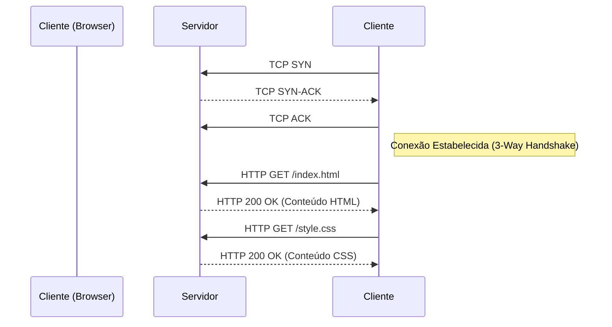

# 🔗 Protocolo HTTP

## 1. Visão Geral
O **HTTP (Hypertext Transfer Protocol)** é um protocolo de camada de aplicação para sistemas de informação distribuídos e colaborativos. É a base da comunicação de dados na World Wide Web.

---

## 2. Ciclo de Vida da Requisição

---

## 3. Métodos e Status

### 3.1. Métodos Principais
- **GET:** Recupera dados. Idempotente (pode repetir sem efeito colateral).
- **POST:** Envia dados para processamento (ex: formulário). Não idempotente.
- **PUT:** Substitui o recurso alvo.
- **DELETE:** Remove o recurso.
- **HEAD:** Igual ao GET, mas sem corpo (só headers).

### 3.2. Códigos de Status
- **2xx (Sucesso):** 200 OK, 201 Created.
- **3xx (Redirecionamento):** 301 Moved Permanently, 304 Not Modified (Cache).
- **4xx (Erro Cliente):** 400 Bad Request, 401 Unauthorized, 404 Not Found.
- **5xx (Erro Servidor):** 500 Internal Server Error, 503 Service Unavailable.

---

## 4. Cache e Cookies

### 4.1. Cache HTTP
Mecanismo para armazenar cópias de respostas para reuso.
- **Cache-Control:** Header principal.
    - `no-store`: Não armazenar nada.
    - `no-cache`: Validar com servidor antes de usar (ETag).
    - `max-age=3600`: Válido por 1 hora.

### 4.2. Cookies
Pequenos dados armazenados no navegador para manter estado (Sessão).
- **Set-Cookie:** Servidor envia para o cliente.
- **Cookie:** Cliente envia de volta em toda requisição subsequente.
- **HttpOnly:** Impede acesso via JavaScript (segurança XSS).
- **Secure:** Só envia via HTTPS.

---

## 5. Versões
- **HTTP/1.1:** Persistência (Keep-Alive), Pipelining.
- **HTTP/2:** Multiplexação (vários requests na mesma conexão TCP), Compressão de Header (HPACK), Server Push.
- **HTTP/3:** Baseado em QUIC (UDP), elimina Head-of-Line Blocking do TCP.

---

## 6. Referências
- **RFC 7230-7235:** HTTP/1.1.
- **RFC 7540:** HTTP/2.
