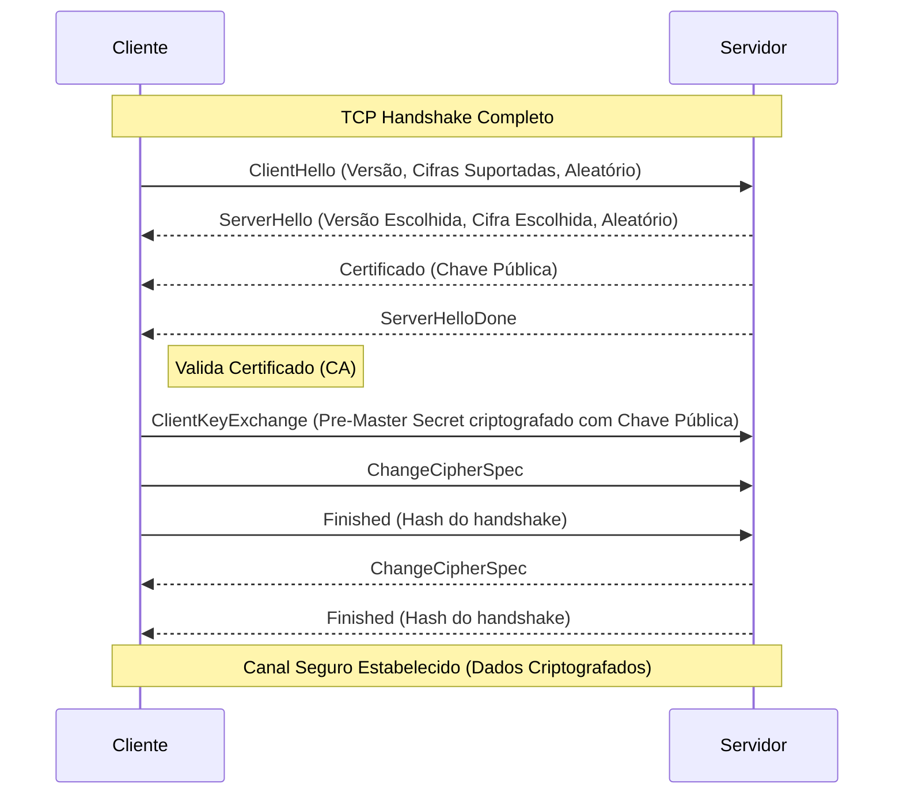

# 🔐 HTTPS (HTTP Secure)

## 1. Visão Geral
O HTTPS é a extensão segura do HTTP. Ele utiliza criptografia (TLS/SSL) para garantir três pilares de segurança:
1.  **Confidencialidade:** Os dados são criptografados (ninguém lê no caminho).
2.  **Integridade:** Os dados não podem ser alterados sem detecção.
3.  **Autenticação:** Garante que você está falando com o servidor correto (via Certificados).

---

## 2. TLS (Transport Layer Security)

O TLS opera entre a camada de transporte (TCP) e a camada de aplicação (HTTP).

### 2.1. Handshake TLS 1.2/1.3

*Nota: O TLS 1.3 simplifica esse processo, reduzindo a latência (1-RTT ou 0-RTT).*

---

## 3. Certificados Digitais (X.509)
Um arquivo digital que liga uma chave pública a uma identidade (domínio).
- **Emissor (CA - Certificate Authority):** Entidade confiável (ex: Let's Encrypt, DigiCert) que assina o certificado.
- **Cadeia de Confiança:** O navegador confia na CA Raiz, que confia na CA Intermediária, que assina o certificado do site.

---

## 4. Referências
- **RFC 8446:** The Transport Layer Security (TLS) Protocol Version 1.3.
