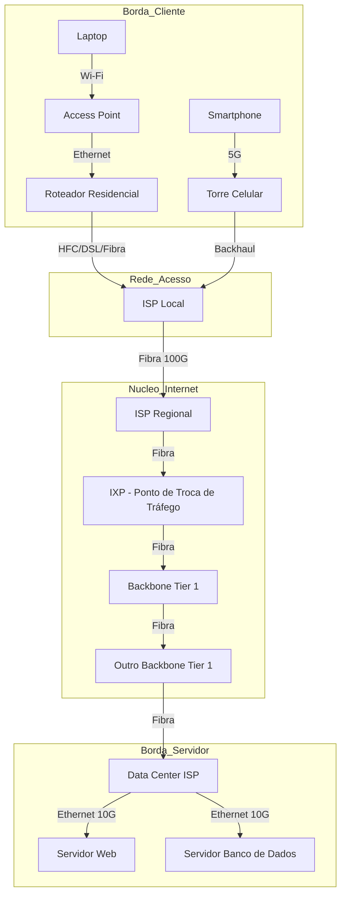

# 🌐 Introdução às Redes de Computadores

## 1. Visão Geral
A Internet é um sistema global de redes de computadores interconectadas que utilizam o conjunto de protocolos padrão da Internet (TCP/IP) para servir bilhões de usuários em todo o mundo. É uma *rede de redes* que consiste em milhões de redes privadas, públicas, acadêmicas, comerciais e governamentais, de escopo local a global.

### 1.1. Definição Técnica
Uma rede de computadores é um conjunto de dispositivos autônomos interconectados por uma tecnologia única e capaz de trocar informações. A conexão pode ser feita por fios de cobre, fibra óptica, micro-ondas, infravermelho e satélites de comunicação.

---

## 2. Arquitetura da Internet: Borda e Núcleo

A arquitetura da Internet é geralmente dividida em duas partes principais: a **Borda** (Edge) e o **Núcleo** (Core).

### 2.1. Borda da Rede (Network Edge)
A borda é composta pelos sistemas finais (hosts) e as redes de acesso.
- **Hosts:** Clientes (desktops, smartphones, laptops) e Servidores (data centers).
- **Redes de Acesso:** A infraestrutura que conecta os hosts ao primeiro roteador de borda (ex: Ethernet, Wi-Fi, 4G/5G, FTTH).

### 2.2. Núcleo da Rede (Network Core)
O núcleo é a malha de roteadores e enlaces de alta capacidade que interconectam as redes de acesso.
- **Função Principal:** Comutação de pacotes e roteamento.
- **Características:** Alta velocidade, redundância, topologia em malha.

---

## 3. Hierarquia de ISPs (Internet Service Providers)

A Internet não é uma nuvem única, mas uma coleção hierárquica de redes gerenciadas por ISPs.

### 3.1. Tier 1 (Backbone Global)
- **Definição:** Redes que possuem cobertura global e se conectam a outras redes Tier 1 sem pagar por trânsito (acordo de *peering* livre).
- **Exemplos:** AT&T, NTT, Level 3 (Lumen), Tata Communications.
- **Características:** Altíssima velocidade, infraestrutura de fibra transoceânica.

### 3.2. Tier 2 (ISP Regional)
- **Definição:** Redes que compram trânsito de Tier 1, mas também fazem peering com outros Tier 2 e atendem clientes Tier 3.
- **Exemplos:** Operadoras nacionais grandes (Vivo, Claro, Comcast).

### 3.3. Tier 3 (ISP Local/Acesso)
- **Definição:** Redes que fornecem acesso direto aos usuários finais (last mile). Compram trânsito de Tier 2.
- **Exemplos:** Provedores locais de bairro, redes municipais.

---

## 4. Comutação de Pacotes vs. Comutação de Circuitos

A Internet fundamentalmente utiliza **Comutação de Pacotes**.

| Característica | Comutação de Circuitos (Telefonia Clássica) | Comutação de Pacotes (Internet) |
| :--- | :--- | :--- |
| **Recursos** | Dedicados (reservados) para a chamada. | Compartilhados sob demanda (multiplexação estatística). |
| **Eficiência** | Baixa (recursos ociosos no silêncio). | Alta (recursos usados apenas quando há dados). |
| **Garantias** | Garante taxa constante (QoS implícito). | "Best Effort" (Melhor Esforço), sem garantias nativas de atraso/perda. |
| **Estabelecimento** | Requer fase de setup de conexão. | Não requer setup (datagramas) ou setup lógico (circuitos virtuais). |

### 4.1. Atrasos na Comutação de Pacotes
O atraso total ($d_{total}$) em um nó é a soma de quatro componentes:

$$ d_{total} = d_{proc} + d_{fila} + d_{trans} + d_{prop} $$

1.  **Atraso de Processamento ($d_{proc}$):** Tempo para examinar o cabeçalho e determinar a saída (< microsegundos).
2.  **Atraso de Fila ($d_{fila}$):** Tempo esperando no buffer de saída (depende do congestionamento).
3.  **Atraso de Transmissão ($d_{trans}$):** Tempo para empurrar os bits para o link ($L/R$, onde $L$ é tamanho do pacote e $R$ é a taxa do link).
4.  **Atraso de Propagação ($d_{prop}$):** Tempo para o sinal viajar pelo meio físico ($d/s$, onde $d$ é distância e $s$ é velocidade da luz no meio).

---

## 5. Modelos de Referência

Para padronizar a comunicação, utilizam-se modelos em camadas.

### 5.1. Encapsulamento
Cada camada adiciona seu próprio cabeçalho (header) aos dados recebidos da camada superior, formando uma PDU (Protocol Data Unit).

- **Camada de Aplicação:** Mensagem
- **Camada de Transporte:** Segmento (TCP) ou Datagrama (UDP)
- **Camada de Rede:** Pacote ou Datagrama IP
- **Camada de Enlace:** Quadro (Frame)
- **Camada Física:** Bits

### 5.2. Comparativo OSI vs. TCP/IP

| Modelo OSI (7 Camadas) | Modelo TCP/IP (4/5 Camadas) | Protocolos Comuns | PDU |
| :--- | :--- | :--- | :--- |
| 7. Aplicação | **Aplicação** | HTTP, DNS, SMTP, SSH | Dados |
| 6. Apresentação | (Integrado na Aplicação) | SSL/TLS, JPEG, ASCII | Dados |
| 5. Sessão | (Integrado na Aplicação) | NetBIOS, RPC | Dados |
| 4. Transporte | **Transporte** | TCP, UDP, QUIC | Segmento |
| 3. Rede | **Internet (Rede)** | IP, ICMP, OSPF, BGP | Pacote |
| 2. Enlace | **Enlace (Acesso à Rede)** | Ethernet, Wi-Fi (802.11) | Quadro |
| 1. Física | **Física** | 1000BASE-T, 802.11ax (PHY) | Bit |

---

## 6. Referências e Leitura Complementar
- **RFC 1122:** Requirements for Internet Hosts - Communication Layers.
- **Livro:** Kurose, J. F., & Ross, K. W. *Computer Networking: A Top-Down Approach*.
- **Livro:** Tanenbaum, A. S. *Computer Networks*.
