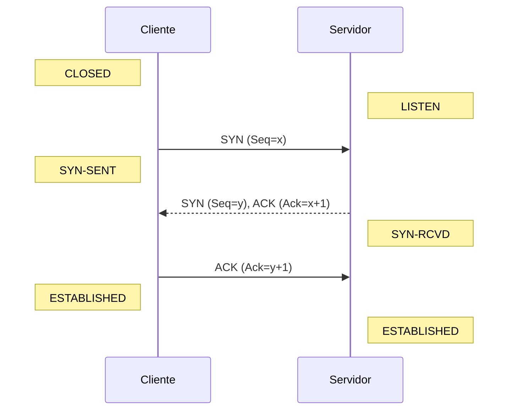

# 🚚 TCP (Transmission Control Protocol)

## 1. Visão Geral
O TCP (RFC 793) é um protocolo da camada de transporte orientado a conexão, confiável e baseado em fluxo de bytes. É o "cavalo de batalha" da Internet, garantindo que os dados cheguem íntegros e na ordem correta.

---

## 2. Estrutura do Segmento TCP

O cabeçalho TCP tem tamanho mínimo de 20 bytes.

| Bit 0-15 | Bit 16-31 |
| :---: | :---: |
| **Porta de Origem** | **Porta de Destino** |
| **Número de Sequência** (32 bits) | |
| **Número de Confirmação (ACK)** (32 bits) | |
| **Offset** (4) \| **Reservado** (6) \| **Flags** (6) | **Janela de Recepção** (16 bits) |
| **Checksum** (16 bits) | **Ponteiro de Urgência** (16 bits) |
| **Opções** (Variável) | **Padding** |

### 2.1. Flags de Controle (Bits URG, ACK, PSH, RST, SYN, FIN)
- **SYN:** Inicia uma conexão (Sincronização).
- **ACK:** Confirma recebimento de dados.
- **FIN:** Encerra uma conexão.
- **RST:** Reseta a conexão (erro).
- **PSH:** Empurra dados para a aplicação imediatamente.
- **URG:** Dados urgentes.

---

## 3. Gerenciamento de Conexão

### 3.1. Three-Way Handshake (Estabelecimento)
Para iniciar uma conexão confiável, cliente e servidor trocam 3 pacotes.

### 3.2. Encerramento (Four-Way Handshake)
Qualquer lado pode terminar a conexão enviando um FIN.

---

## 4. Controle de Fluxo e Congestionamento

### 4.1. Controle de Fluxo (Janela Deslizante)
Evita que o transmissor sobrecarregue o **receptor**.
- O receptor anuncia sua **Janela de Recepção (rwnd)** no cabeçalho TCP.
- O transmissor garante que `BytesEnviados - BytesConfirmados <= rwnd`.

### 4.2. Controle de Congestionamento
Evita que o transmissor sobrecarregue a **rede**.
- O transmissor mantém uma variável de estado chamada **Janela de Congestionamento (cwnd)**.
- **Slow Start:** Começa devagar (cwnd = 1 MSS) e dobra a cada RTT (exponencial).
- **Congestion Avoidance:** Ao atingir um limiar (ssthresh), cresce linearmente.
- **Fast Retransmit/Fast Recovery:** Se receber 3 ACKs duplicados, retransmite o pacote perdido sem esperar timeout e reduz cwnd pela metade (TCP Reno).

---

## 5. Referências
- **RFC 793:** Transmission Control Protocol.
- **RFC 5681:** TCP Congestion Control.
