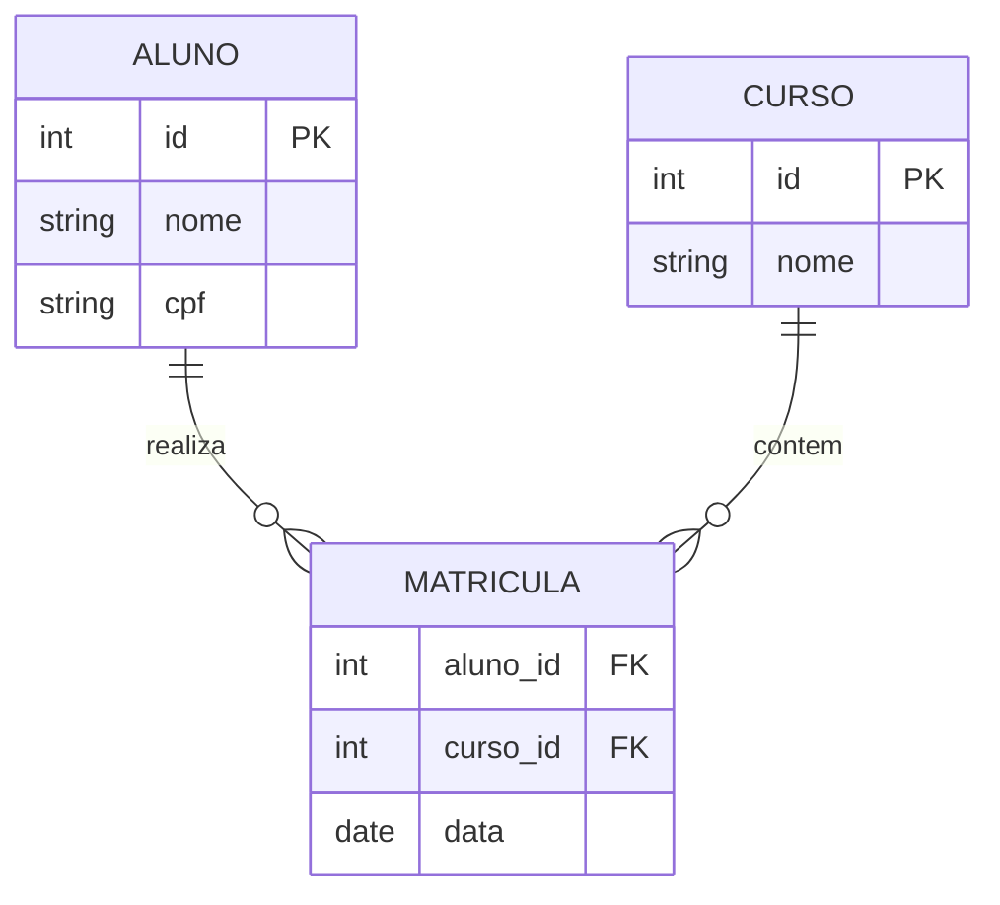

# 🏛️ Unidade 1: Modelagem de Dados

## 1. Níveis de Abstração
O projeto de um banco de dados passa por três níveis fundamentais de abstração:

### 1.1. Modelo Conceitual (O "O Quê")
- **Foco:** Entender o negócio e os requisitos.
- **Independência:** Totalmente independente de tecnologia (SGBD).
- **Ferramenta:** Diagrama Entidade-Relacionamento (DER).
- **Exemplo:** Cliente, Pedido, Produto.

### 1.2. Modelo Lógico (O "Como")
- **Foco:** Estruturar os dados para um tipo de banco (Relacional, Documental).
- **Dependência:** Depende do paradigma (ex: Relacional), mas não do software específico (Postgres vs Oracle).
- **Ferramenta:** Esquema Relacional (Tabelas, Chaves Estrangeiras).
- **Exemplo:** Tabela `tb_cliente` com PK `id_cliente`.

### 1.3. Modelo Físico (O "Onde")
- **Foco:** Implementação real no SGBD.
- **Dependência:** Totalmente dependente do software (tipos de dados específicos, índices, particionamento).
- **Ferramenta:** Script SQL (DDL).
- **Exemplo:** `CREATE TABLE tb_cliente (id SERIAL PRIMARY KEY...)`.

---

## 2. Modelo Entidade-Relacionamento (Conceitual)

O Modelo ER descreve o mundo real.

### 2.1. Componentes
- **Entidade:** Objeto do mundo real (ex: Aluno). Retângulo.
- **Atributo:** Característica (ex: Nome). Elipse.
    - *Identificador:* Chave única (sublinhado).
    - *Composto:* Endereço (Rua, CEP).
    - *Multivalorado:* Telefones (Elipse dupla).
- **Relacionamento:** Associação (ex: Matricula-se). Losango.

### 2.2. Cardinalidade
- **1:1:** Um para Um (CPF pertence a uma Pessoa).
- **1:N:** Um para Muitos (Turma tem muitos Alunos).
- **N:N:** Muitos para Muitos (Aluno cursa muitas Disciplinas).

---

## 3. Modelo Relacional (Lógico)

Traduz o ER para tabelas.

### 3.1. Regras de Integridade
1.  **Entidade:** PK única e não nula.
2.  **Referencial:** FK aponta para PK válida.
3.  **Domínio:** Valores respeitam o tipo.

### 3.2. Normalização
Processo matemático para reduzir redundância e anomalias.

#### Primeira Forma Normal (1FN)
- **Regra:** Não permitir atributos multivalorados ou compostos. Cada campo deve ser atômico.
- **Solução:** Criar nova tabela para o atributo multivalorado (ex: Tabela `Telefone`).

#### Segunda Forma Normal (2FN)
- **Regra:** Estar na 1FN e não ter dependência parcial (atributos dependendo só de parte da chave composta).
- **Solução:** Separar em tabelas diferentes. Se `(AlunoID, CursoID) -> Nota` e `(CursoID) -> NomeCurso`, o `NomeCurso` deve sair para a tabela `Curso`.

#### Terceira Forma Normal (3FN)
- **Regra:** Estar na 2FN e não ter dependência transitiva (atributo dependendo de atributo não-chave).
- **Solução:** Se `Pedido -> ClienteID -> CidadeCliente`, a `CidadeCliente` depende do `ClienteID`, não do `Pedido`. Mover para tabela `Cliente`.

---

## 4. Mapeamento ER → Relacional

Como transformar o desenho em tabelas?

### 4.1. Entidades Fortes
Viram tabelas independentes. A chave identificadora vira **Primary Key (PK)**.

### 4.2. Entidades Fracas
Viram tabelas que dependem de outra. A PK é composta: **PK da Forte + Discriminador da Fraca**.

### 4.3. Relacionamentos
- **1:N:** A chave da tabela do lado "1" vai para a tabela do lado "N" como **Foreign Key (FK)**.
- **N:N:** Cria-se uma **nova tabela associativa** contendo as FKs das duas tabelas originais. A PK dessa nova tabela é a composição das duas FKs.
- **1:1:** A FK pode ficar em qualquer lado (geralmente no lado que "obriga" a existência do outro), com restrição `UNIQUE`.

