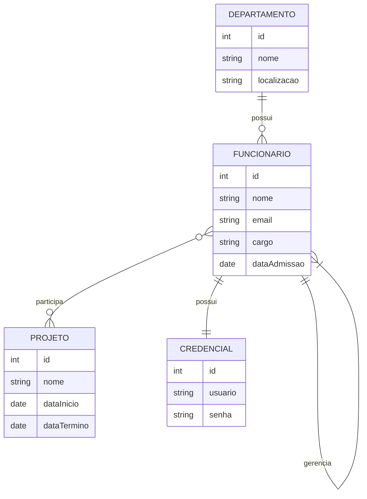

# Modelo Entidade-Relacionamento (E-R) 

## Descrição do Cenário

Neste sistema corporativo, temos as seguintes entidades:

- **Funcionário:** Representa os colaboradores da empresa.
- **Departamento:** Representa as áreas ou setores da empresa.
- **Projeto:** Representa os projetos em que os funcionários podem estar envolvidos.
- **Credencial:** Representa as credenciais de acesso exclusivas de cada funcionário.

Cada funcionário é designado a um único departamento, mas um departamento pode abrigar diversos funcionários (relacionamento 1:N). Funcionários podem participar de vários projetos, e cada projeto pode contar com diversos colaboradores (relacionamento N:N). Além disso, há uma autorelação entre funcionários, onde um colaborador pode atuar como gerente de outros. Por fim, cada funcionário possui uma credencial exclusiva, e cada credencial é atribuída a apenas um funcionário (relacionamento 1:1).

---

## Entidades e Atributos

### Funcionário
- **ID:** Identificador único.
- **Nome:** Nome completo.
- **Email:** Endereço eletrônico.
- **Cargo:** Posição ou função exercida.
- **Data de Admissão:** Data de ingresso na empresa.

### Departamento
- **ID:** Identificador único.
- **Nome:** Nome do departamento.
- **Localização:** Endereço ou sede do departamento.

### Projeto
- **ID:** Identificador único.
- **Nome:** Nome do projeto.
- **Data de Início:** Data de início do projeto.
- **Data de Término:** (Opcional) Data prevista ou efetiva de conclusão.

### Credencial
- **ID:** Identificador único.
- **Usuario:** Nome de usuário para acesso.
- **Senha:** Senha de acesso (armazenada de forma segura).

---

## Relacionamentos e Explicações

- **Departamento e Funcionário (1:N):**  
  Cada departamento pode ter vários funcionários associados, enquanto cada funcionário pertence a um único departamento. Esse relacionamento organiza a estrutura interna da empresa, definindo setores e áreas de atuação.

- **Funcionário e Projeto (N:N):**  
  Funcionários podem participar de diversos projetos e cada projeto pode contar com a participação de vários funcionários. Em implementações práticas, esse relacionamento é gerenciado por meio de uma entidade associativa (por exemplo, uma tabela que vincula o ID do funcionário ao ID do projeto), facilitando a consulta e a manutenção dos dados.

- **Autorrelação em Funcionário (1:N):**  
  No cenário corporativo, um funcionário pode atuar como gerente de outros colaboradores. Dessa forma, cada funcionário (exceto os de nível hierárquico superior) terá um gerente, e um gerente pode ser responsável por vários subordinados. Esse relacionamento reforça a estrutura hierárquica da organização.

- **Funcionário e Credencial (1:1):**  
  Cada funcionário possui uma credencial exclusiva que permite seu acesso ao sistema. Esse relacionamento 1:1 garante que cada credencial esteja associada a um único colaborador, promovendo maior segurança e controle de acesso.

---

## Visualizando o Modelo 

