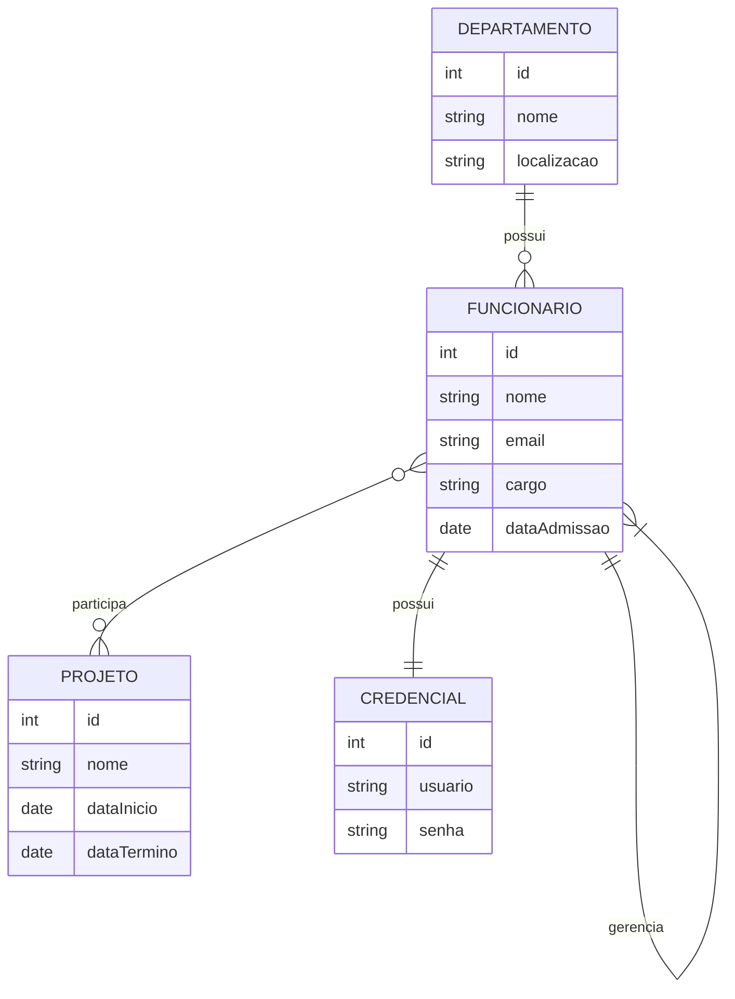

# 🧩 **Exemplo - Modelo Entidade-Relacionamento (E-R)**

> "Transforme ideias complexas em estruturas simples e organizadas!"

---

## 📖 **Introdução**

O Modelo E-R é como um mapa para organizar dados de forma clara e eficiente. Ele ajuda a entender como diferentes partes de um sistema se conectam e interagem. Imagine que você está construindo uma base de dados para uma empresa. O Modelo E-R será seu guia para garantir que tudo funcione perfeitamente.

Cada componente do modelo tem um papel específico:

- **Entidades:** São os "atores principais" do sistema (ex.: funcionários, departamentos).
- **Atributos:** São as características ou propriedades desses atores (ex.: nome, email, cargo).
- **Relacionamentos:** Mostram como os atores se conectam entre si (ex.: um funcionário pertence a um departamento).
- **Cardinalidade:** Define quantos atores podem se relacionar entre si (ex.: um departamento pode ter muitos funcionários).

---

## 🔑 **Conceitos Fundamentais**

### 1. **Entidade**

Uma **entidade** é algo que existe no mundo real e precisa ser representado no banco de dados.  
_Papel:_ Cada entidade geralmente corresponde a uma tabela no banco de dados.  
_Exemplo:_ Em um sistema corporativo, "Funcionário" é uma entidade que representa cada colaborador da empresa.

> **Dica Didática**: Pense nas entidades como "caixas" onde você armazena informações importantes.

---

### 2. **Atributo**

Um **atributo** é uma característica ou propriedade que descreve uma entidade.  
_Função:_ Os atributos armazenam os dados que definem cada instância da entidade.

**Tipos de Atributos:**

- **Simples:** Não podem ser divididos (ex.: CPF, RG).
- **Compostos:** Podem ser subdivididos (ex.: Endereço → rua, cidade, estado, CEP).
- **Derivados:** Calculados a partir de outros atributos (ex.: Idade → calculada a partir da data de nascimento).

> **Dica Didática**: Imagine os atributos como "etiquetas" que descrevem o conteúdo de cada caixa (entidade).

---

### 3. **Relacionamento**

Um **relacionamento** mostra como duas ou mais entidades estão conectadas.  
_Função:_ Ele define as regras de como as entidades interagem entre si.

**Tipos de Relacionamentos:**

- **1:1 (Um para Um):** Cada instância de uma entidade se relaciona com apenas uma instância de outra.  
  _Exemplo:_ Um funcionário tem uma credencial exclusiva.
- **1:N (Um para Muitos):** Uma instância de uma entidade se relaciona com várias instâncias de outra.  
  _Exemplo:_ Um departamento pode ter vários funcionários.
- **N:N (Muitos para Muitos):** Várias instâncias de uma entidade podem se relacionar com várias instâncias de outra.  
  _Exemplo:_ Funcionários podem participar de vários projetos, e projetos podem ter vários funcionários.
- **Autorrelação:** Uma entidade se relaciona consigo mesma, útil para hierarquias.  
  _Exemplo:_ Um funcionário pode ser gerente de outros funcionários.

> **Dica Didática**: Pense nos relacionamentos como "pontes" que conectam as caixas (entidades).

---

### 4. **Cardinalidade**

A **cardinalidade** define quantas instâncias de uma entidade podem se relacionar com instâncias de outra. Ela é crucial para garantir a integridade dos dados.

**Símbolos Comuns:**

- `||` significa **1**.
- `o{` significa **0 ou muitos**.
- `|{` significa **1 ou muitos**.

> **Dica Didática**: Cardinalidade é como uma "regra de trânsito" que diz quantas "pessoas" podem atravessar a ponte (relacionamento).

---

## 🏭 **Exemplo Prático: Sistema Corporativo**

Vamos aplicar os conceitos acima a um sistema corporativo. Abaixo estão as entidades, seus atributos e os relacionamentos entre elas.

### **Entidades e Seus Atributos**

- **Funcionário:** Representa os colaboradores da empresa.  
  _Atributos:_

  - `id` (identificador único)
  - `nome` (nome completo)
  - `email` (endereço eletrônico)
  - `cargo` (posição/função)
  - `dataAdmissao` (data de ingresso)

- **Departamento:** Representa os setores ou áreas da empresa.  
  _Atributos:_

  - `id` (identificador único)
  - `nome` (nome do departamento)
  - `localizacao` (endereço ou sede)

- **Projeto:** Representa os projetos que a empresa desenvolve.  
  _Atributos:_

  - `id` (identificador único)
  - `nome` (nome do projeto)
  - `dataInicio` (data de início do projeto)
  - `dataTermino` (data prevista ou efetiva de conclusão)

- **Credencial:** Representa as informações de acesso exclusivas de cada funcionário.  
  _Atributos:_
  - `id` (identificador único)
  - `usuario` (nome de usuário)
  - `senha` (senha, armazenada de forma segura)

---

### **Relacionamentos e Sua Funcionalidade**

1. **Departamento ↔ Funcionário (1:N):**  
   _Descrição:_ Cada departamento pode ter vários funcionários, mas cada funcionário pertence a apenas um departamento.  
   _Aplicação Técnica:_ Implementado com uma chave estrangeira na tabela `Funcionário` que referencia o `Departamento`.

2. **Funcionário ↔ Projeto (N:N):**  
   _Descrição:_ Funcionários podem trabalhar em diversos projetos, e cada projeto pode contar com vários funcionários.  
   _Aplicação Técnica:_ Implementado por meio de uma tabela associativa chamada `FuncionarioProjeto`, que armazena as chaves primárias de ambos.

3. **Autorrelação em Funcionário (1:N):**  
   _Descrição:_ Um funcionário pode ser gerente de outros funcionários.  
   _Aplicação Técnica:_ Adiciona-se uma coluna `gerenteId` na tabela `Funcionário`, referenciando o próprio registro de funcionário.

4. **Funcionário ↔ Credencial (1:1):**  
   _Descrição:_ Cada funcionário possui uma credencial única que garante acesso seguro ao sistema.  
   _Aplicação Técnica:_ Implementado com uma relação 1:1, onde a chave primária de `Credencial` também é uma chave estrangeira que referencia `Funcionário`.

---

## 🖥️ **Diagrama ER com Mermaid**

O diagrama abaixo ilustra o modelo E-R do sistema corporativo, incluindo os tipos de relacionamentos discutidos:

> **Dica Didática**: Leia o diagrama como uma história. Por exemplo: "Um departamento possui muitos funcionários", "Um funcionário pode participar de vários projetos", etc.

---

## 🎯 **Conclusão**

O Modelo Entidade-Relacionamento é uma ferramenta poderosa para planejar bancos de dados. Ele ajuda a:

- **Organizar Dados:** Estruture suas informações de forma lógica e clara.
- **Garantir Integridade:** Defina regras que protegem a consistência dos dados.
- **Facilitar a Comunicação:** Use o modelo para explicar o sistema a colegas e stakeholders.
- **Implementar Regras Complexas:** Modele hierarquias, relações muitos para muitos e muito mais.
