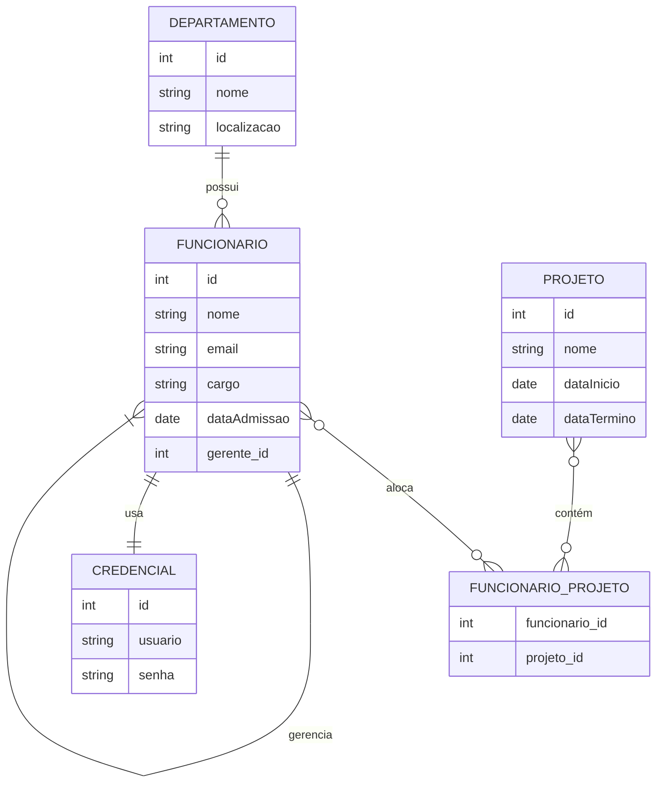

# 🧩 Modelo Entidade-Relacionamento (E-R)

> "Organize sua base de dados como um arquiteto organiza um prédio: com clareza, estrutura e propósito."

---

## 🌟 O Cenário: Uma Empresa em Ação

Imagine que você é responsável por criar um sistema para gerenciar os dados de uma empresa. A empresa precisa controlar informações sobre **colaboradores**, **departamentos**, **projetos** e **credenciais de acesso**. Esses dados precisam ser organizados de forma lógica e eficiente.

Por exemplo:

- Ana Silva trabalha no departamento de TI.
- Ela participa de dois projetos: "App Mobile" e "CRM Web".
- Para acessar o sistema, ela usa a credencial "asilva".

O **Modelo Entidade-Relacionamento (E-R)** nos ajuda a mapear essas informações de forma visual e estruturada.

---

## 📋 Entidades e Atributos

Entidades são os principais objetos ou conceitos que queremos representar no banco de dados. Cada entidade tem atributos que descrevem suas características.

| **Entidade**     | **Atributos Principais**                  | **Exemplo de Valor**                                                            |
| ---------------- | ----------------------------------------- | ------------------------------------------------------------------------------- |
| **Funcionário**  | ID, Nome, Email, Cargo, Data de Admissão  | `(1, “Ana Silva”, “[ana@ex.com](mailto:ana@ex.com)”, “Analista”, “2023-08-01”)` |
| **Departamento** | ID, Nome, Localização                     | `(10, “TI”, “Prédio A – Sala 101”)`                                             |
| **Projeto**      | ID, Nome, Data de Início, Data de Término | `(100, “App Mobile”, “2024-01-15”, “2024-12-31”)`                               |
| **Credencial**   | ID, Usuário, Senha (hash)                 | `(500, “asilva”, “\$2b\$…”)`                                                    |

> **Dica Didática**: Pense nas entidades como as "coisas importantes" que você precisa armazenar no banco de dados. Os atributos são as propriedades que descrevem essas coisas.

---

## 🔗 Relacionamentos

Os relacionamentos mostram como as entidades se conectam entre si. Eles ajudam a definir regras sobre como os dados interagem.

### 1. Departamento ↔ Funcionário (1:N)

- **Descrição**: Um departamento pode ter muitos funcionários, mas cada funcionário pertence a apenas um departamento.
- **Exemplo**: O departamento de TI (ID=10) tem Ana, Bruno e Carlos.
- **Símbolo no Diagrama**: `DEPARTAMENTO ||--o{ FUNCIONARIO`

### 2. Funcionário ↔ Projeto (N:N)

- **Descrição**: Um funcionário pode participar de vários projetos, e um projeto pode ter vários funcionários.
- **Como Implementar**: Use uma tabela associativa chamada `funcionario_projeto` com as colunas `funcionario_id` e `projeto_id`.
- **Exemplo**: Ana (ID=1) e Bruno (ID=2) estão no projeto "App Mobile" (ID=100); Ana também está no projeto "CRM Web" (ID=101).
- **Símbolo no Diagrama**:
  ```
  FUNCIONARIO }o--o{ FUNCIONARIO_PROJETO : "aloca"
  PROJETO }o--o{ FUNCIONARIO_PROJETO : "contém"
  ```

### 3. Autorrelação em Funcionário (1:N)

- **Descrição**: Um funcionário pode ser gerente de outros funcionários.
- **Como Implementar**: Adicione um atributo `gerente_id` na entidade `FUNCIONARIO`.
- **Exemplo**: Carlos (ID=3) é gerente de Ana (ID=1) e Bruno (ID=2).
- **Símbolo no Diagrama**: `FUNCIONARIO ||--|{ FUNCIONARIO : "gerencia"`

### 4. Funcionário ↔ Credencial (1:1)

- **Descrição**: Cada funcionário tem uma única credencial, e cada credencial pertence a um único funcionário.
- **Exemplo**: Ana (ID=1) usa a credencial "asilva".
- **Símbolo no Diagrama**: `FUNCIONARIO ||--|| CREDENCIAL : "usa"`

> **Dica Didática**: Pense nos relacionamentos como "pontes" que conectam as entidades. As cardinalidades (1:1, 1:N, N:N) mostram quantos elementos de cada lado podem estar envolvidos.

---

## 🖥️ Diagrama em Mermaid

O diagrama abaixo resume todas as entidades, atributos e relacionamentos. Ele é criado usando a linguagem Mermaid, que permite visualizar rapidamente o modelo E-R.



> **Dica Didática**: Leia o diagrama como uma história. Por exemplo, "Um departamento possui muitos funcionários", "Um funcionário aloca-se em projetos por meio da tabela associativa", etc.

---

## ✍️ Dicas de Estudo

1. **Comece pelas Entidades**: Identifique quais são as "coisas importantes" do seu sistema e liste seus atributos.
2. **Defina os Relacionamentos**: Pergunte-se: "Quem se relaciona com quem?" e "Quantos elementos estão envolvidos?"
3. **Use Símbolos para Cardinalidades**:
   - `||` significa 1.
   - `o{` significa 0 ou muitos.
   - `|{` significa 1 ou muitos.
4. **Identifique Tabelas Associativas**: Sempre que houver um relacionamento N:N, crie uma tabela intermediária.
5. **Desenhe Primeiro à Mão**: Faça um rascunho no papel antes de usar ferramentas como Mermaid ou software especializado.

---

### **Conclusão**

O Modelo Entidade-Relacionamento é uma ferramenta poderosa para planejar bancos de dados. Ele transforma ideias complexas em estruturas claras e organizadas. Pratique identificando entidades, atributos e relacionamentos em diferentes cenários até se sentir confortável com o processo.
