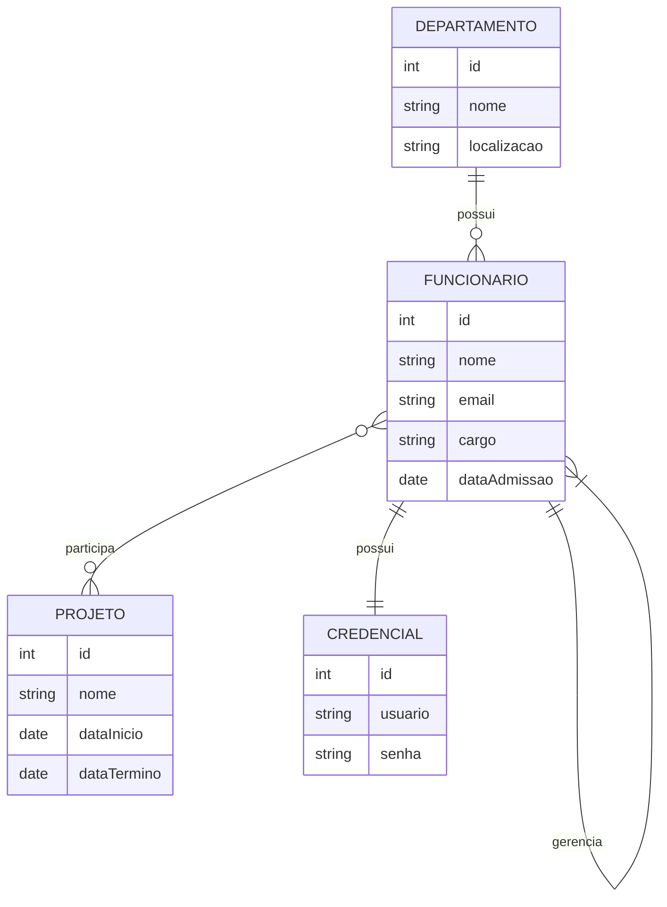

# Modelo Entidade-Relacionamento (E-R) 

## Introdução

O Modelo E-R é uma ferramenta essencial na modelagem de dados, permitindo representar de forma clara a estrutura lógica dos dados em um sistema. Ele facilita a compreensão das relações entre entidades e garante que o banco de dados seja projetado de maneira robusta e escalável. Cada componente do modelo tem uma função específica:

- **Entidades:** Representam objetos ou conceitos do mundo real com existência própria.
- **Atributos:** São as características ou propriedades das entidades.
- **Relacionamentos:** Definem como as entidades se conectam e interagem.
- **Cardinalidade:** Especifica o número de instâncias que podem estar associadas entre entidades.

---

## Conceitos Fundamentais

### Entidade
Uma **entidade** é um objeto ou conceito que pode ser identificado de forma única no domínio de interesse.  
*Função:* Em bancos de dados relacionais, cada entidade geralmente corresponde a uma tabela.  
*Exemplo:* Em um sistema corporativo, "Funcionário" é uma entidade que representa cada colaborador da empresa.

### Atributo
Um **atributo** é uma propriedade ou característica que descreve uma entidade.  
*Função:* Os atributos armazenam os dados que definem cada instância da entidade.  
*Tipos de Atributos:*
- **Simples:** Indivisíveis (ex.: CPF).
- **Compostos:** Podem ser subdivididos (ex.: Endereço: rua, cidade, estado, CEP).
- **Derivados:** Calculados a partir de outros atributos (ex.: Idade a partir da data de nascimento).

### Relacionamento
Um **relacionamento** é uma associação entre duas ou mais entidades.  
*Função:* Ele define como as entidades interagem entre si e é implementado através de chaves estrangeiras em bancos de dados relacionais.  
*Tipos de Relacionamentos:*
- **1:1 (Um para Um):** Cada instância de uma entidade se relaciona com uma única instância de outra.
- **1:N (Um para Muitos):** Uma instância de uma entidade se relaciona com várias instâncias de outra.
- **N:N (Muitos para Muitos):** Várias instâncias de uma entidade podem se relacionar com várias instâncias de outra, geralmente implementado via uma tabela associativa.
- **Autorrelação:** Uma entidade se relaciona consigo mesma, útil para modelar hierarquias.

### Cardinalidade
A **cardinalidade** determina a quantidade de instâncias de uma entidade que podem se relacionar com instâncias de outra entidade. Ela é crucial para definir as regras de negócio e garantir a integridade dos dados.

---

## Exemplo Prático: Sistema Corporativo

Neste exemplo, implementamos um sistema corporativo que utiliza os seguintes componentes:

### Entidades e Seus Atributos

- **Funcionário:** Representa os colaboradores da empresa.  
  *Atributos:*  
  - `id` (identificador único)  
  - `nome` (nome completo)  
  - `email` (endereço eletrônico)  
  - `cargo` (posição/função)  
  - `dataAdmissao` (data de ingresso)

- **Departamento:** Representa os setores ou áreas da empresa.  
  *Atributos:*  
  - `id` (identificador único)  
  - `nome` (nome do departamento)  
  - `localizacao` (endereço ou sede)

- **Projeto:** Representa os projetos que a empresa desenvolve.  
  *Atributos:*  
  - `id` (identificador único)  
  - `nome` (nome do projeto)  
  - `dataInicio` (data de início do projeto)  
  - `dataTermino` (data prevista ou efetiva de conclusão)

- **Credencial:** Representa as informações de acesso exclusivas de cada funcionário.  
  *Atributos:*  
  - `id` (identificador único)  
  - `usuario` (nome de usuário)  
  - `senha` (senha, armazenada de forma segura)

### Relacionamentos e Sua Funcionalidade

- **Departamento e Funcionário (1:N):**  
  *Descrição:* Cada departamento pode ter vários funcionários, mas cada funcionário pertence a apenas um departamento.  
  *Aplicação Técnica:* Implementado através de uma chave estrangeira no registro de funcionário que referencia o departamento.

- **Funcionário e Projeto (N:N):**  
  *Descrição:* Funcionários podem trabalhar em diversos projetos, e cada projeto pode contar com vários funcionários.  
  *Aplicação Técnica:* Implementado por meio de uma tabela associativa (ex.: `FuncionarioProjeto`), que armazena as chaves primárias de ambos os registros.

- **Autorrelação em Funcionário (1:N):**  
  *Descrição:* Um funcionário pode ser gerente de outros funcionários.  
  *Aplicação Técnica:* Uma coluna de gerente (geralmente, `gerenteId`) é adicionada à tabela de Funcionário, referenciando o próprio registro de funcionário.

- **Funcionário e Credencial (1:1):**  
  *Descrição:* Cada funcionário possui uma credencial única que garante acesso seguro ao sistema.  
  *Aplicação Técnica:* Implementado com uma relação 1:1, onde a chave primária de `Credencial` é também uma chave estrangeira que referencia `Funcionário`.

---

## Diagrama ER com Mermaid

O diagrama abaixo ilustra o modelo E-R do sistema corporativo, incluindo os tipos de relacionamentos discutidos:

> Ou veja em [ExemploER](ExemploER.md)
---

## Conclusão 

O Modelo Entidade-Relacionamento é fundamental para a criação de bancos de dados eficientes e coerentes. Ao compreender e aplicar os conceitos de entidades, atributos, relacionamentos e cardinalidade, é possível:

- Estruturar dados de forma lógica e organizada.
- Garantir a integridade e consistência dos dados.
- Facilitar a comunicação entre desenvolvedores e stakeholders.
- Implementar regras de negócio complexas, como hierarquias (autorrelação) e relações muitos para muitos, com clareza e eficiência.
