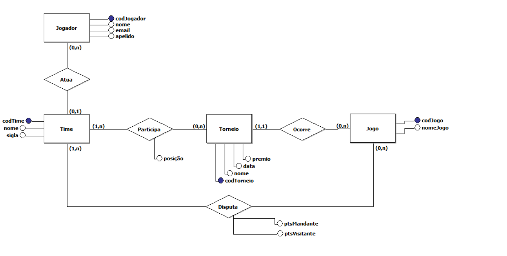

# Documentação do Sistema de E-sports - Brawl Stars

Este documento reúne de forma organizada o modelo conceitual (ER), o modelo lógico-relacional, os scripts de criação e popularização de tabelas, além de exemplos de consultas SQL para um sistema de gerenciamento de competições de **Brawl Stars**.

---

## 1. Modelo Conceitual (ER)

O diagrama ER é composto pelas seguintes entidades e relacionamentos:

- **Time**: representa as equipes que competem.
- **Jogador**: cada pro player está associado a, no máximo, um time (pode ser free agent).
- **Torneio**: eventos em que os times participam.
- **Participação**: associa um time a um torneio, registrando a posição final.
- **Jogo**: cada partida, vinculada a um torneio e envolvendo dois times (mandante e visitante) com seus respectivos pontos.

O relacionamento entre **Time** e **Jogo** é feito diretamente na entidade Jogo, por meio dos atributos `codTimeMandante` e `codTimeVisitante`, o que deixa claro os papéis de cada equipe na partida.


---

## 2. Modelo Lógico-Relacional

```plaintext
Time(codTime PK, nome, sigla)

Jogador(codJogador PK, nome, email, apelido, codTime FK → Time)

Torneio(codTorneio PK, premio, data, nome)

Participacao(codParticipacao PK, codTime FK → Time, codTorneio FK → Torneio, posicao)

Jogo(codJogo PK, codTorneio FK → Torneio, codTimeMandante FK → Time,
     codTimeVisitante FK → Time, ptsTimeMandante, ptsTimeVisitante, nomeJogo)
```

- Cada tabela-relacionamento (Participacao) recebe uma chave primária própria (`codParticipacao`).
- A coluna `codTime` em Jogador é opcional, permitindo jogadores sem equipe.

---

## 3. Scripts de Criação (PostgreSQL)

```sql
-- 1. TIME\CREATE TABLE time (
  codTime    SERIAL PRIMARY KEY,
  nome       VARCHAR(100) NOT NULL,
  sigla      VARCHAR(10) UNIQUE NOT NULL
);

-- 2. TORNEIO
CREATE TABLE torneio (
  codTorneio SERIAL PRIMARY KEY,
  premio     NUMERIC(12,2),
  data       DATE NOT NULL,
  nome       VARCHAR(100) NOT NULL
);

-- 3. JOGADOR
CREATE TABLE jogador (
  codJogador SERIAL PRIMARY KEY,
  nome       VARCHAR(100) NOT NULL,
  email      VARCHAR(255) UNIQUE NOT NULL,
  apelido    VARCHAR(50),
  codTime    INT REFERENCES time(codTime)
);

-- 4. PARTICIPACAO
CREATE TABLE participacao (
  codParticipacao SERIAL PRIMARY KEY,
  codTime         INT NOT NULL REFERENCES time(codTime),
  codTorneio      INT NOT NULL REFERENCES torneio(codTorneio),
  posicao         INT
);

-- 5. JOGO
CREATE TABLE jogo (
  codJogo            SERIAL PRIMARY KEY,
  codTorneio         INT NOT NULL REFERENCES torneio(codTorneio),
  codTimeMandante    INT NOT NULL REFERENCES time(codTime),
  codTimeVisitante   INT NOT NULL REFERENCES time(codTime),
  ptsTimeMandante    INT,
  ptsTimeVisitante   INT,
  nomeJogo           VARCHAR(100) NOT NULL
);
```

> **Observações**: uso de `SERIAL` para auto-incremento; nomes em minúsculas sem aspas.

---

## 4. Scripts de Inserção (Exemplos com 15 registros em cada tabela)

```sql
-- Times
INSERT INTO time (codTime, nome, sigla) VALUES
(1, 'SK Gaming', 'SKG'),
(2, 'Team Queso', 'TQO'),
... até 15;

-- Torneios
INSERT INTO torneio (codTorneio, premio, data, nome) VALUES
(1, 100000.00, '2024-02-15', 'Spring Cup 2024'),
... até 15;

-- Jogadores
INSERT INTO jogador (codJogador, nome, email, apelido, codTime) VALUES
(1, 'Sweet', 'sweet@skg.com', 'Sweet', 1),
... até 15;

-- Participacoes
INSERT INTO participacao (codParticipacao, codTime, codTorneio, posicao) VALUES
(1, 1, 1, 2),
... até 15;

-- Jogos
INSERT INTO jogo (codJogo, codTorneio, codTimeMandante, codTimeVisitante, ptsTimeMandante, ptsTimeVisitante, nomeJogo) VALUES
(1, 1, 1, 2, 3, 2, 'SK Gaming x Team Queso'),
... até 15;
```

> ## Cada `... até 15` deve ser substituído pelos demais registros de exemplo, seguindo o padrão demonstrado.
>
> Veja em [Inserts.sql](../sql/insert.sql)

---

## 5. Exemplos de Consultas SQL

1. **Consulta básica** (JOIN entre Jogador e Time):

   ```sql
   SELECT j.nome AS jogador, t.nome AS equipe
   FROM jogador j
   JOIN time t ON j.codTime = t.codTime
   WHERE t.sigla = 'TQO';
   ```

2. **Três tabelas** (Participacao, Time, Torneio):

   ```sql
   SELECT t.nome AS equipe, tor.nome AS torneio, p.posicao
   FROM participacao p
   JOIN time t ON p.codTime = t.codTime
   JOIN torneio tor ON p.codTorneio = tor.codTorneio
   WHERE EXTRACT(YEAR FROM tor.data) = 2024;
   ```

3. **Agrupamento e filtragem**:

   ```sql
   SELECT t.nome, COUNT(*) AS jogos_com_mais_de_2_pts
   FROM jogo j
   JOIN time t ON j.codTimeMandante = t.codTime
   WHERE j.ptsTimeMandante > 2
   GROUP BY t.nome
   HAVING COUNT(*) >= 2
   ORDER BY jogos_com_mais_de_2_pts DESC;
   ```

4. **Função de agregação + subconsulta**:
   ```sql
   SELECT t.nome, ROUND(AVG(ap.total_pts), 2) AS media_pontos
   FROM (
     SELECT codTimeMandante AS codTime, ptsTimeMandante AS total_pts FROM jogo
     UNION ALL
     SELECT codTimeVisitante, ptsTimeVisitante FROM jogo
   ) ap
   JOIN time t ON ap.codTime = t.codTime
   GROUP BY t.nome
   ORDER BY media_pontos DESC
   LIMIT 5;
   ```
   > Trabalho realizado em grupo!
