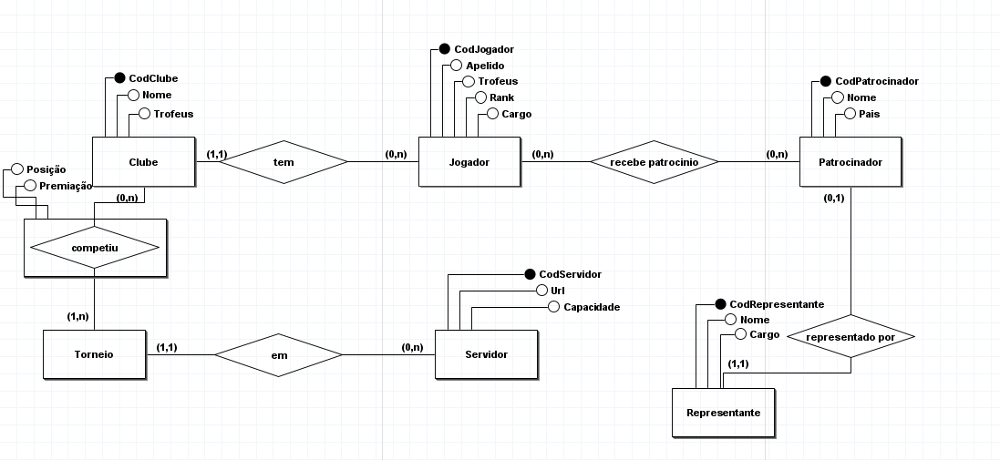
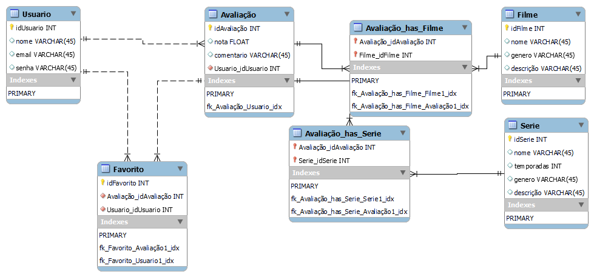

# Instituto Federal de Educação, Ciência e Tecnologia do Rio Grande do Sul

**Curso Técnico em Informática Integrado ao Ensino Médio**  
**Disciplina:** Banco de Dados II  
**Professor:** Gabriel Marchesan

---

# Trabalho Prático – Modelagem de Dados & SQL

## Descrição

Trabalho prático envolvendo modelagem de banco de dados e consultas SQL no SGBD **PostgreSQL**.

O trabalho consiste em:

1. Construir uma base de dados de um domínio/área de aplicação.
2. Elaborar **4 consultas SQL** conforme critérios específicos.
3. Apresentar:
   - Modelo Conceitual (Diagrama ER)
   - Modelo Lógico Relacional (texto)
   - Modelo Físico (tabelas e inserts)

---

## Exemplo (Campeonato de Futebol)

> Veja no PDF disponibilizado pelo professor.

## Consultas Requeridas

- **Consulta 1:** `SELECT – FROM – WHERE`, no mínimo 2 tabelas, com sentido.
- **Consulta 2:** `SELECT – FROM – WHERE`, no mínimo 3 tabelas, com sentido.
- **Consulta 3:** `SELECT – FROM – WHERE – GROUP BY – HAVING – ORDER BY`, com 2 ou mais tabelas, diferente das anteriores.
- **Consulta 4:** `SELECT – FROM – WHERE`, com função de agregação e pelo menos uma entre `GROUP BY`, `HAVING`, `ORDER BY`.

---

## Regras do Trabalho

- A definição dos dados e tipos a serem armazenados é parte do trabalho.
- **Bases muito semelhantes às vistas em aula não serão aceitas.**
- Utilizar o **SGBD PostgreSQL**.
- O trabalho pode ser feito em grupos de até 6 alunos.
- Mínimo de **5 tabelas** no banco de dados.
- **Arquivos exigidos na entrega via Moodle:**
  - Modelo Conceitual (PDF ou JPEG)
  - Modelo Lógico Relacional (PDF)
  - Script SQL para criação/população do BD (`.sql`)
  - Script SQL com as 4 consultas (`.sql`)

---

## Dicas de Ferramentas

- **Notepad++** para edição de arquivos `.sql`  
  https://notepad-plus-plus.org/downloads/

- **brModelo** para criar o diagrama ER
  - Versão 2.0: [Google Drive](https://drive.google.com/drive/u/2/folders/1XIigo7cXocK7r2McwIi3-83XXa12v0ZU)
  - Versão 3.3.1: [Google Drive](https://drive.google.com/drive/u/2/folders/1bhIbfoPh1tOAYIaxOf_AX1WTX_1kkQJ5)

---

## Entrega

- **Data de entrega:** até **01/05/2025 (quinta-feira) às 23h55min**, via Moodle.
- Não serão aceitos **arquivos compactados**.
- A entrega fora dos padrões **não será considerada**.
- Peso: **3,0 pontos** na média do 1º trimestre.
- **Apresentação prevista:** 08/05/2025 (quinta-feira), com possibilidade de perguntas.

---

# Realização

Pra iniciar foi necessário fazer o modelo conceitual E-R. Pra isso, utilizou-se do brModelo, disponível em:
[brModelo/](src/brModelo/). [brModelo.exe](src/brModelo/brModelo.exe) e [brModelo.jar](src/brModelo/brModelo.jar).
> Na minha máquina ambos os programas apresentaram erros.

Modelo Base:

> Irei testar em um "programa de verdade" pra ver se essa estrutura faz sentido, ou não.

Após alguns testes resolvi por alterar o modelo, que segue: 

Após testar cheguei a conclusão que era uma estrutura bem falha e ia contra o que eu queria... Então montei uma nova, veja em: [BrawlStars.txt](src/base/BrawlStars.txt) ou abaixo:
