# Aula – 21/02

Hoje aprendi como criar um projeto no _Apache NetBeans_. Abaixo, deixo um resumo dos passos que segui para configurar e rodar meu projeto:

---

## 1. Abrindo o NetBeans

- **Iniciando o Programa:**  
  Primeiro, abri o Apache NetBeans.  
  

- **Criando um Novo Projeto:**  
  Em seguida, selecionei a opção para criar um novo projeto.  
  

---

## 2. Configurando o Projeto

- **Selecionando o Template:**  
  Escolhi a opção **Java with Ant**.  
  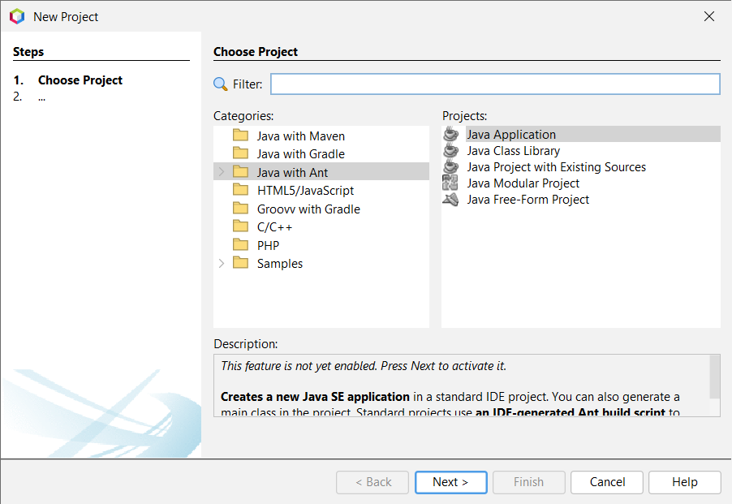

- **Definindo Nome e Configurações Iniciais:**  
  Dei um nome ao projeto e desmarquei a criação automática da classe `main` (não há necessidade, conforme explicado na aula).  
  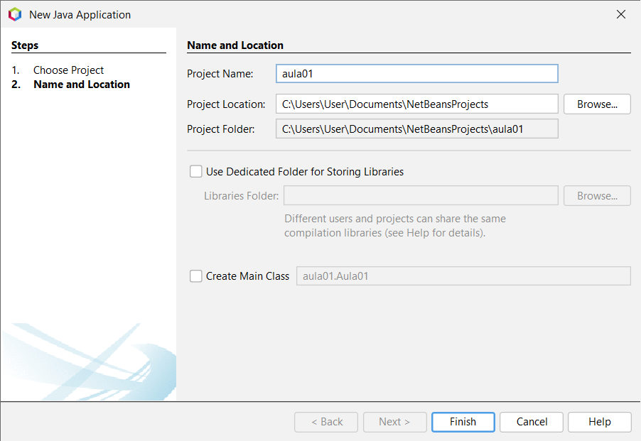

- **Visualizando a Estrutura Inicial:**  
  Essa é a estrutura inicial do meu projeto:  
  

- **Realizando Alterações:**  
  Após algumas modificações, minha estrutura ficou assim:  
  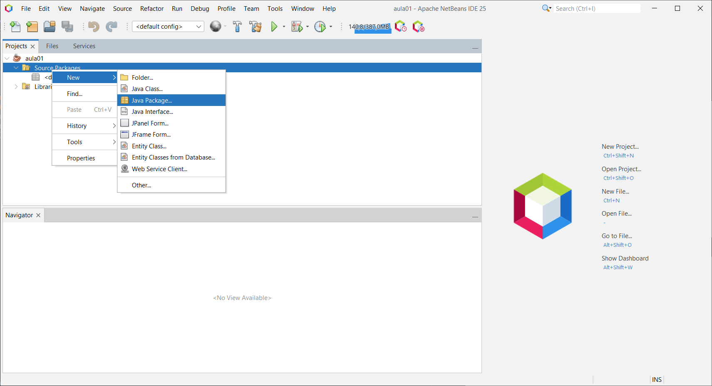  
  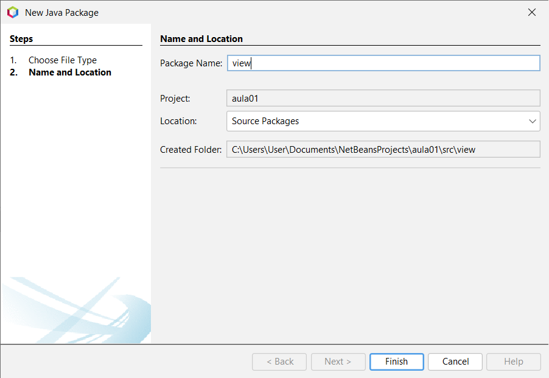  
  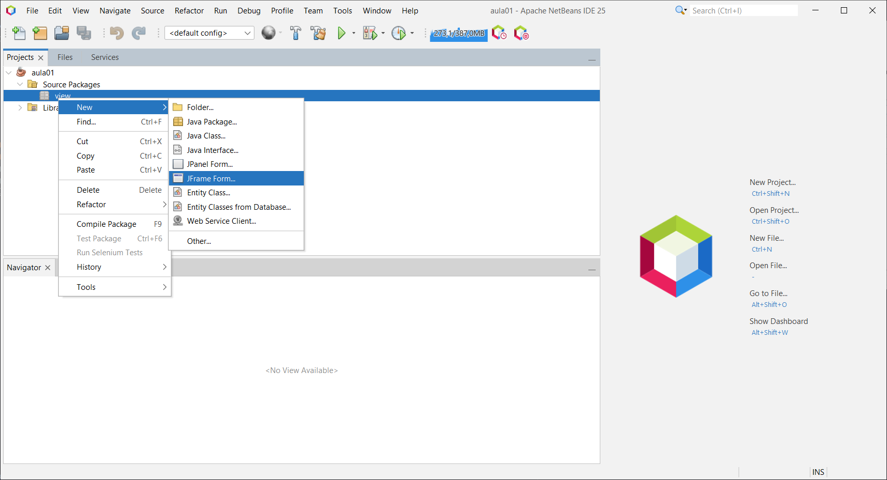  
  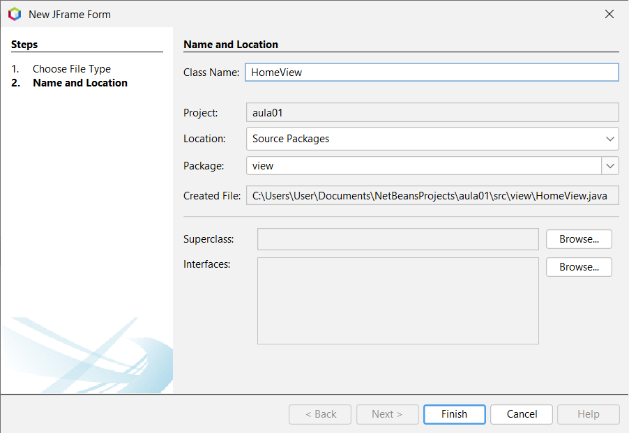  
  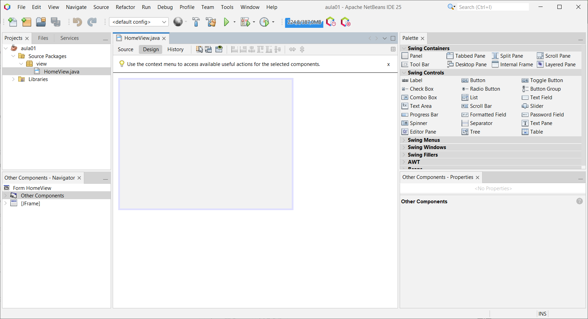

---

## 3. Desenvolvendo a Interface

- **Modo Design:**  
  Iniciei o design arrastando componentes da _Palette_ para a tela.

- **Recuperando a Aba de Propriedades:**  
  Caso a aba de propriedades desapareça, utilizei a função de busca para recuperá-la.  
  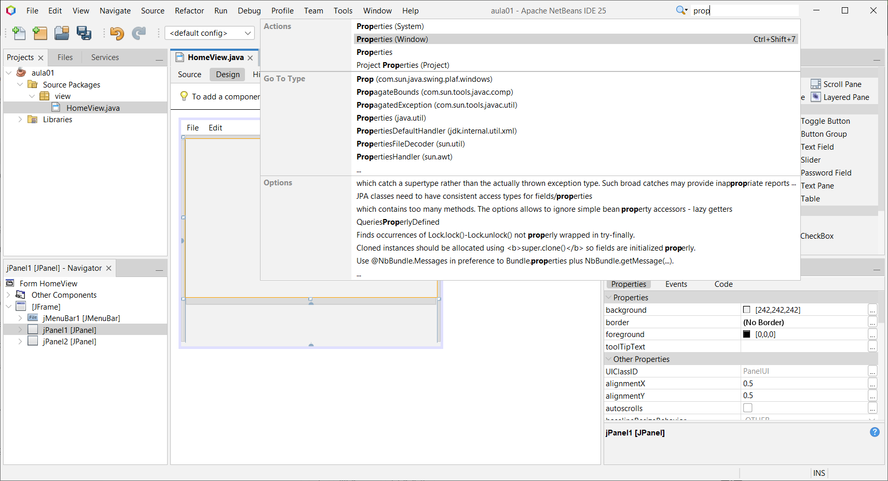

- **Componentes Adicionados:**  
  Ao final, adicionei:

  - Menu Bar
  - Dois Painéis
  - Um Botão (com background customizado)

  O layout final ficou assim:  
  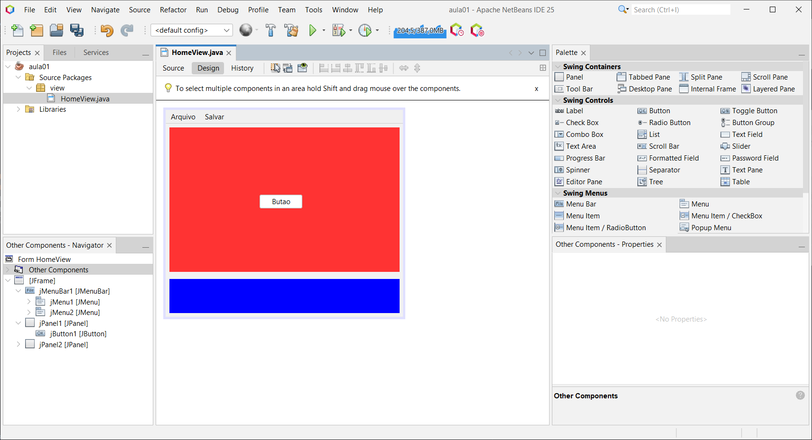

---

## 4. Adicionando Eventos

- **Configurando o Evento no Botão:**  
  Cliquei no botão para adicionar um evento.  
  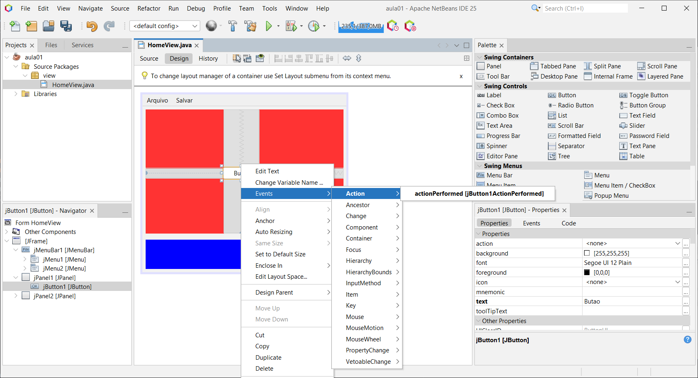

- **Definindo a Ação do Evento:**  
  Configurei a ação que será executada ao clicar no botão.  
  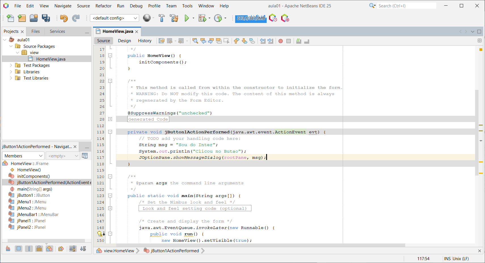

### Exemplo de Código do Evento

```java
private void jButton1ActionPerformed(java.awt.event.ActionEvent evt) {
    // TODO: Adicione seu código aqui
    String msg = "Sou do Inter";
    System.out.println("Clicou no Botão");
    JOptionPane.showMessageDialog(rootPane, msg);
}
```

> **Observação:** Esse código é apenas um exemplo. Em uma aplicação real, a implementação pode variar conforme a necessidade.

---

## 5. Executando o Projeto

- **Rodando o Projeto:**  
  Para testar, pressione `F6`.  
  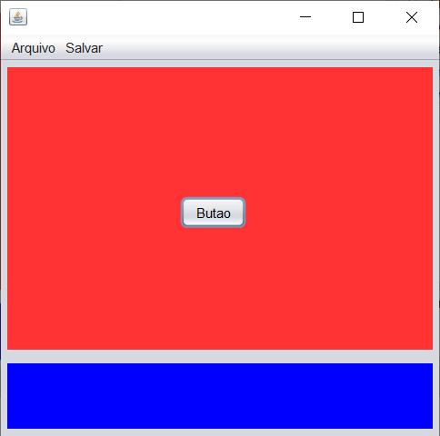

- **Resolvendo Erro "Sem Classe main":**  
  Se aparecer o erro "sem classe main", clique em `<default config>`.
  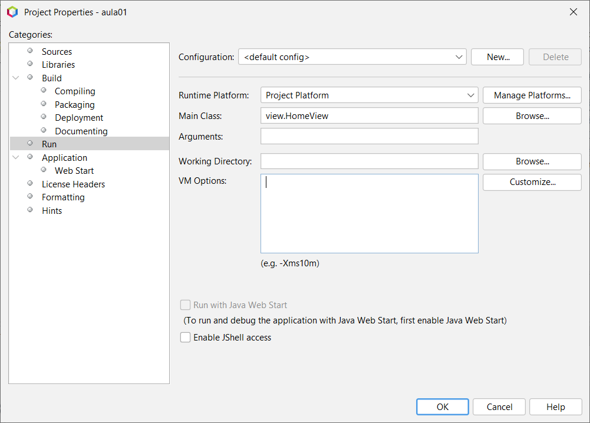

- **Testando a Interface:**  
  Ao clicar no botão, a mensagem deverá ser exibida na tela.  
  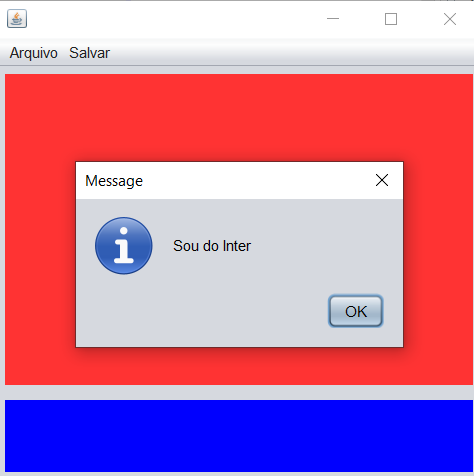

- **Finalizando a Execução:**  
  Para encerrar, utilize `Shift+F11` ou o botão correspondente ao lado do _Run_.  
  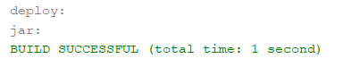

---

## 6. Localizando

- **Localização do Projeto:**  
  Após os testes, navegue até a pasta do projeto, por exemplo:
  `C:\Users\User\Documents\NetBeansProjects\aula01\dist`

- **Executando o Arquivo .jar:**  
  Para rodar o programa em outros dispositivos (com Java instalado), execute o arquivo `.jar`.

> **Atenção:** Certifique-se de que o Java está configurado nas variáveis de ambiente. Existem outros métodos para distribuir uma aplicação Java.

---
