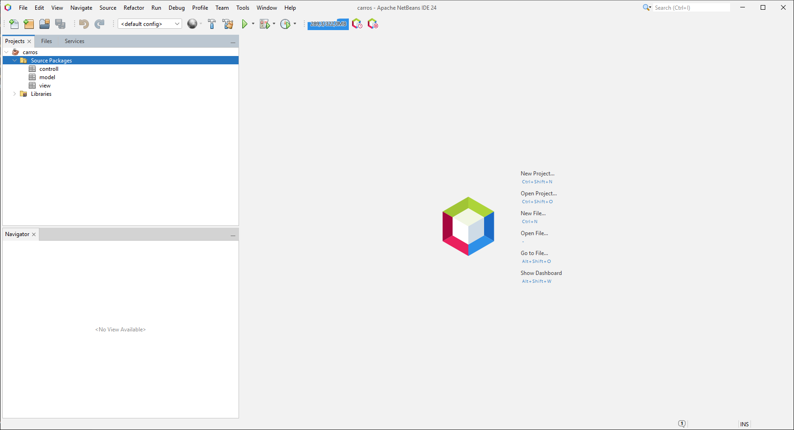

# Aula 28/02

## Criação do Projeto

1. **Iniciar um Novo Projeto**  
   Clique em **New Project**.
   <div align="center">
     
   </div>

2. **Selecionar a Tecnologia**  
   Escolha **Java with Ant**.
   <div align="center">
     
   </div>

3. **Definir o Nome do Projeto**  
   Informe o nome desejado para o projeto.
   <div align="center">
     
   </div>

4. **Criar a Estrutura Básica**  
   A estrutura inicial do projeto será criada conforme ilustrado:
   <div align="center">
     
     
     
     
     
     
   </div>

---

## Refatoração do Sistema

Realize os seguintes ajustes para padronização:

- **Pastas:** Devem iniciar com letra minúscula.  
- **Classes:** Devem iniciar com letra maiúscula.  
- **Projeto:** O nome deve iniciar com letra maiúscula.

Após a refatoração, a estrutura deverá ficar assim:
<div align="center">
  
</div>

---

## Desenvolvimento do Código

### Início do Código

Inicie a criação do código clicando com o botão direito do mouse na pasta desejada:
<div align="center">
  
  
  
  
</div>

#### Dica de Formatação
Utilize o atalho **Shift + Alt + F** para formatar o código automaticamente.
<div align="center">
  
</div>

---

### Criação do Construtor

Após gerar o método construtor, o código deverá ficar semelhante ao exemplo abaixo:

```java
public Carro(int id, int ano, String modelo) {
    this.id = id;
    this.ano = ano;
    this.modelo = modelo;
}
```

---

### Método para Logs

Dentro da classe Carro, implemente um método que apresente os atributos do objeto para gerar logs detalhados, conforme exemplificado a seguir:

```java
public void imprimir() {
    System.out.println("=========");
    System.out.println("id: " + id);
    System.out.println("ano: " + ano);
    System.out.println("modelo: " + modelo);
    System.out.println("=========");
}
```

---

### Criação do Controlador

Crie o controlador conforme a imagem a seguir:
<div align="center">
  
</div>

### Método Main para Teste

Implemente o método `main` para testar o funcionamento do projeto:
<div align="center">
  
</div>

```java
public class ContoladorTeste {

    public static void main(String[] args) {
        Carro cl1 = new Carro(0, 2012, "Corolla");
        Carro cl2 = new Carro(0, 2012, "Gol");
        Carro cl3 = new Carro(0, 2012, "Uno");

        cl1.imprimir();
        cl2.imprimir();
        cl3.imprimir();
    }
}
```

Após a implementação, execute o projeto (pressione **F6**). O resultado final deverá ser semelhante ao demonstrado abaixo:
<div align="center">
  
</div>

---

## Exercícios

**Questão:** Como criar uma classe com métodos getters, setters e construtor.

**Tarefa:** No caderno, elabore 5 classes, cada uma contendo 5 atributos. Todas as classes devem possuir um atributo **ID**.  
**Exemplos de Classes:**
- Aluno
- Professor
- Escola
- Turma
- Matéria

<div style="text-align: center; font-size: 20px;">
  <a href="../exercicios/Exercicio01.md">Resolução</a>
</div>


---
