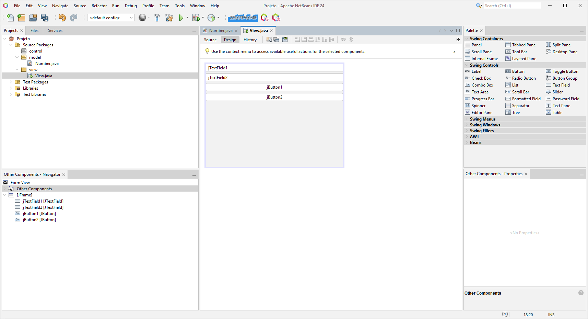
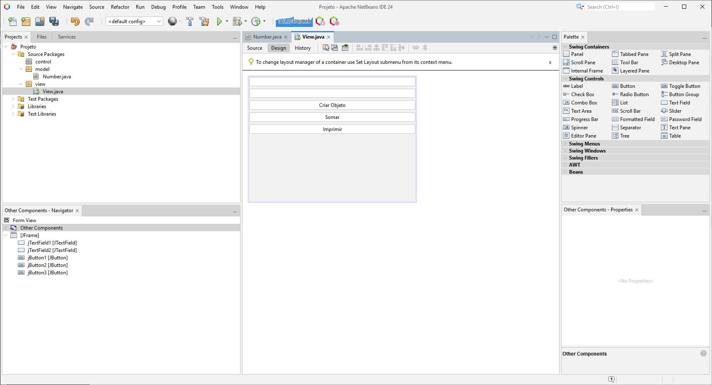
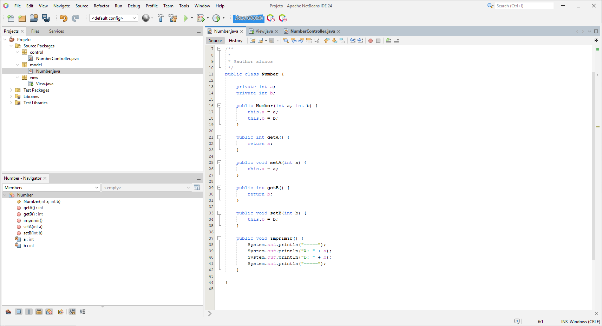
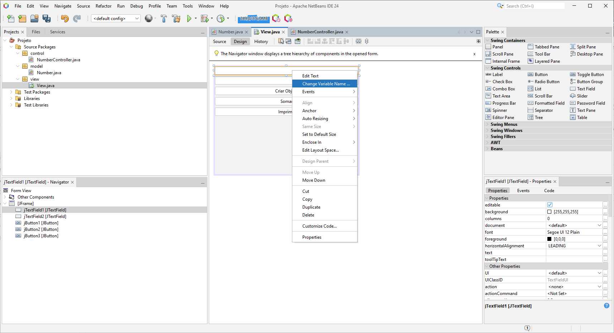
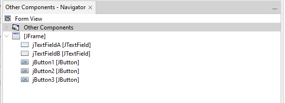
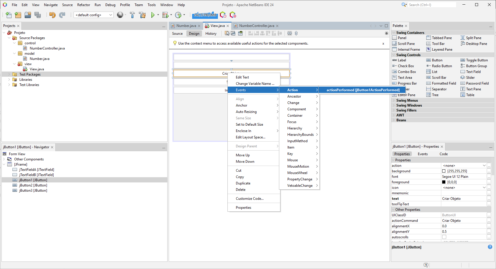
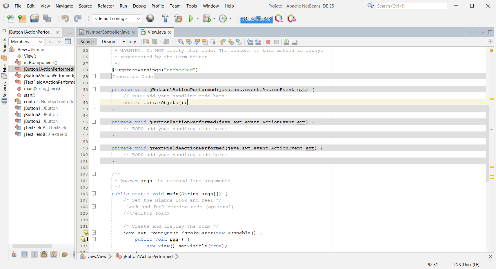

# Aula 07/03

## Estrutura Inicial do Projeto

Caso deseje rever como criar um projeto, consulte a [Primeira Aula](Aula01.md).

A estrutura básica do projeto é organizada da seguinte forma:

```
Projeto
│
├── Source Package
│   ├── model
│   │   └── Number.java
│   ├── control
│   │   └── NumberController.java
│   └── view
│       └── View.java

```

Essa organização facilita a manutenção e a separação das responsabilidades entre as camadas.

---

## Tela Inicial

### Interface Inicial

A captura abaixo mostra a tela inicial do projeto:



### Atualização da Interface

Após adicionar um novo botão e alterar os textos, a interface ficou conforme a imagem abaixo:



---

## Modelo

O modelo, que contém a lógica de negócio, está localizado na pasta `model`.

### Exemplo Visual do Modelo



### Código do Modelo

A classe `Number` foi implementada conforme o código abaixo:

```java
public class Number {

    private int a;
    private int b;

    public Number(int a, int b) {
        this.a = a;
        this.b = b;
    }

    public int getA() {
        return a;
    }

    public void setA(int a) {
        this.a = a;
    }

    public int getB() {
        return b;
    }

    public void setB(int b) {
        this.b = b;
    }

    public void imprimir() {
        System.out.println("=====");
        System.out.println("A: " + a);
        System.out.println("B: " + b);
        System.out.println("=====");
    }
}
```

---

## Controlador

O controlador gerencia a interação entre a interface (view) e o modelo, definindo a lógica do sistema.

### Exemplo de Implementação

A classe `NumberController` demonstra como associar os campos de texto à lógica do projeto:

```java
public class NumberController {

    JTextField jTextFieldA;
    JTextField jTextFieldB;

    public NumberController() {
    }

    public NumberController(JTextField jTextFieldA, JTextField jTextFieldB) {
        this.jTextFieldA = jTextFieldA;
        this.jTextFieldB = jTextFieldB;
    }

    public void criarObjeto() {
        // Metodo Facil
        String nA = jTextFieldA.getText();
        int numberA = Integer.parseInt(nA);

        // Metodo Dificil
        int numberB = Integer.parseInt(jTextFieldB.getText());

        n = new Number(numberA, numberB);
    }
}
```

> _Observação:_ Adicionei um exemplo de implementação do método `criarObjeto()`, que extrai os valores dos campos de texto, cria um objeto `Number` e chama o método de impressão.

---

## Alteração dos Campos de Texto

Para que os campos de texto da interface correspondam aos nomes definidos no controlador, realize as seguintes alterações:

1. Altere os nomes dos componentes na interface para `jTextFieldA` e `jTextFieldB`.
2. Após a alteração, a interface deverá ficar semelhante à imagem abaixo:





---

## Eventos

A criação dos eventos permite a interação do usuário com o sistema, vinculando ações da interface a métodos do controlador.

### Configuração e Código do Evento

A configuração do evento do botão foi realizada conforme as capturas a seguir:

1. **Configuração do Evento:**

   

2. **Redirecionamento para o Código do Evento:**

   

O código gerado para o evento `actionPerformed` é o seguinte:

```java
private void jButton1ActionPerformed(java.awt.event.ActionEvent evt) {
    control.criarObjeto();
}
```
