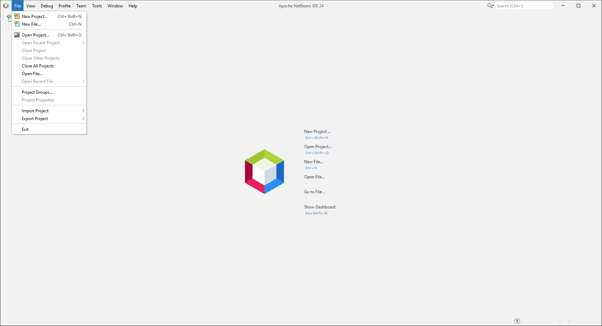
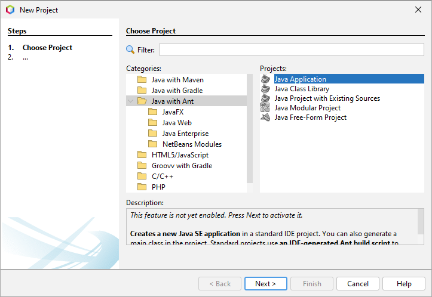
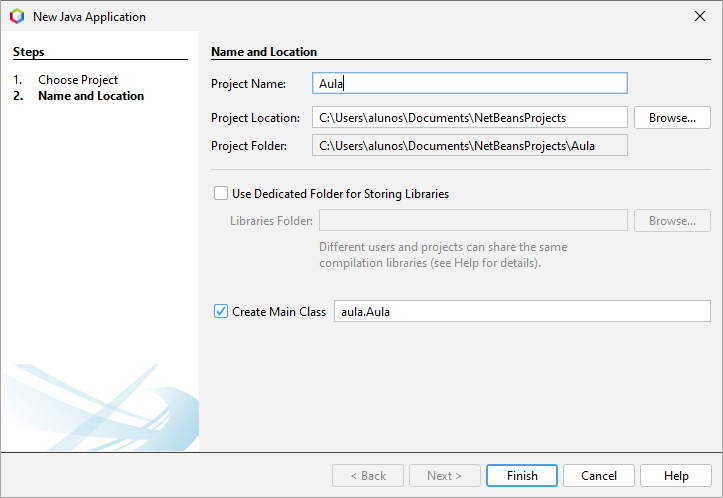
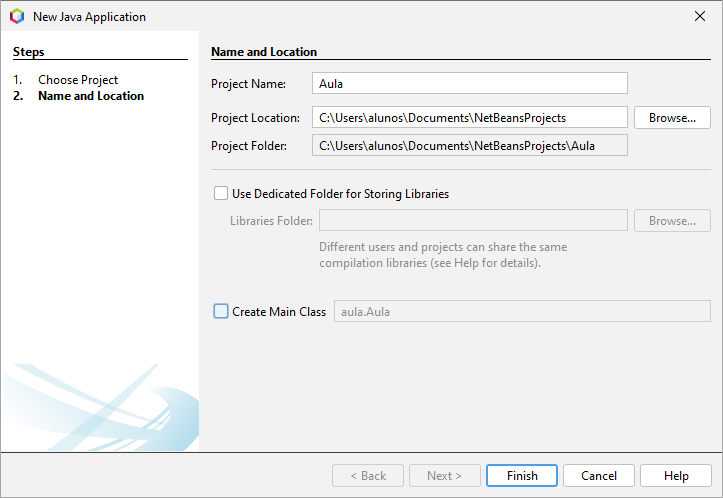
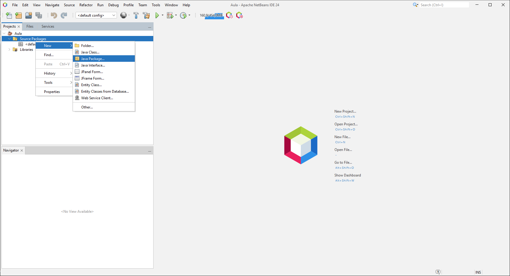
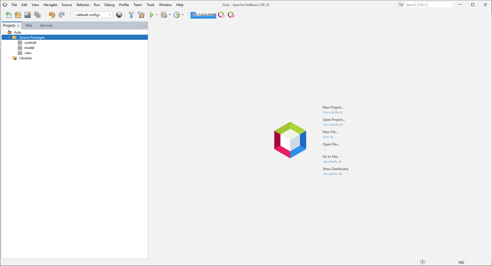
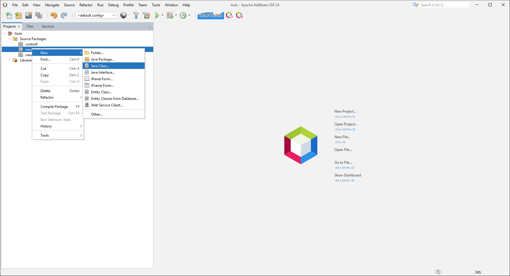
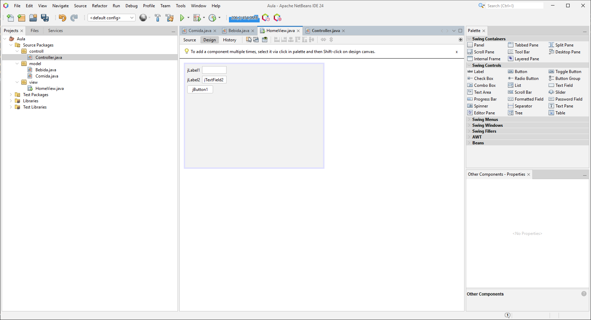
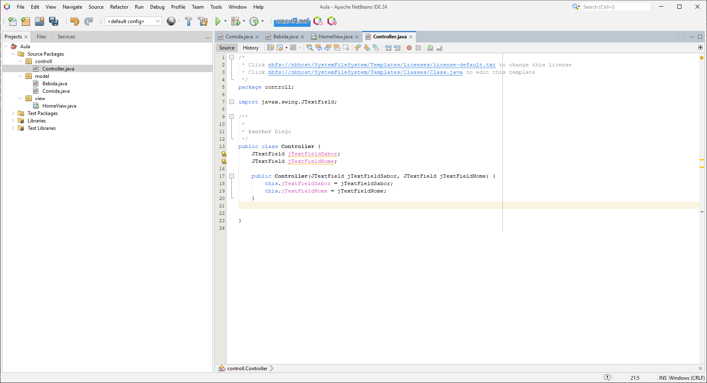

# Aula 14/03/25

### Criação do Projeto

  
  
  


### Criação de Pacotes

```java
for (int i = 0; i < 3; i++) {
    System.out.println("Criar Pacote");
}
```

> **Dica:** Utilize o atalho **Alt + Insert** para adicionar código rapidamente.


  


## Adicionando Métodos e Construtores

Para facilitar a manipulação dos dados, adicione os métodos _getters_ e _setters_, o construtor e um método `imprimir()` para fins de log:

```java
public void imprimir() {
    System.out.println("=====================");
    System.out.println("Sabor: " + sabor);
    System.out.println("Nome: " + nome);
    System.out.println("=====================");
}
```



## Criação de Novos Modelos

### Modelo: Bebida

Crie um novo modelo chamado `Bebida` conforme o exemplo abaixo:

```java
public class Bebida {

    String bernardo;
    float tempo;

    public void imprimir() {
        System.out.println("bernardo: " + bernardo);
        System.out.println("tempo: " + tempo);
    }
}
```

## Configuração da Interface

### HomeView

Crie a `HomeView` no diretório `/view` conforme ilustrado:



### Controle

Configure também o controle da aplicação:



## Projeto Disponível

Baixe o projeto completo em: [Projeto Comida](Projects/ProjetoComida/)
