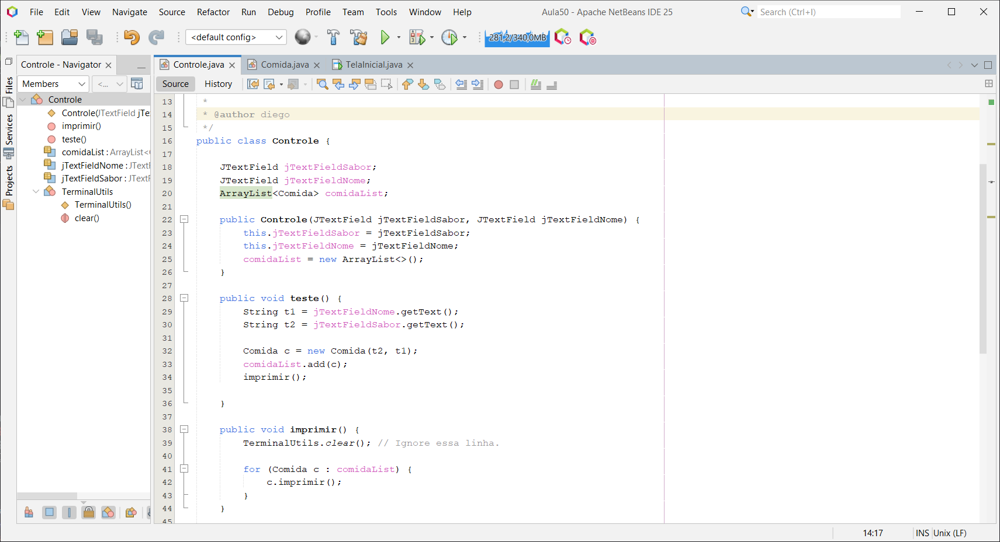
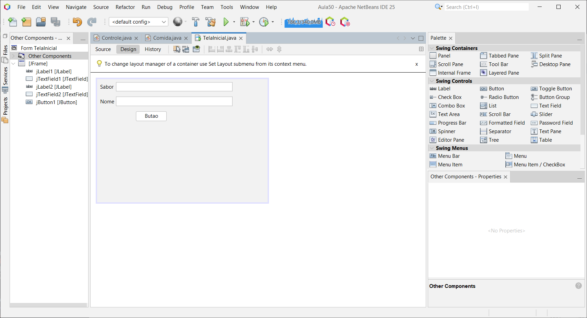

# Aula 21/03/25

## Download do Projeto

Baixe o arquivo compactado contendo o projeto:

- [Aula.zip](Projects/Aula05.zip)

## Modificações Realizadas

Foram efetuadas alterações no *controller* e na interface, resultando na seguinte aparência:

  

## Testando o Projeto

Após as modificações, teste a aplicação baixando o arquivo executável:

- [Aula.jar](Dist/Aula05/Aula05.jar)

> **Atenção:** A execução do projeto deve ser realizada via terminal!
