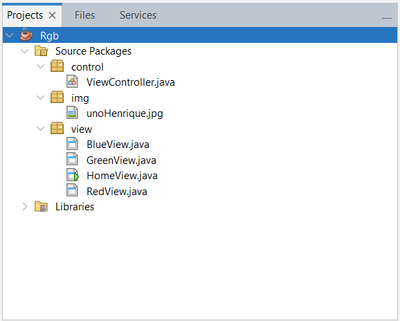
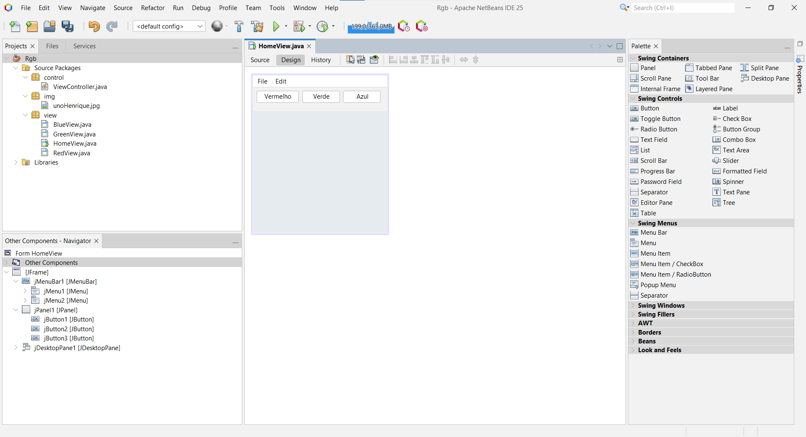
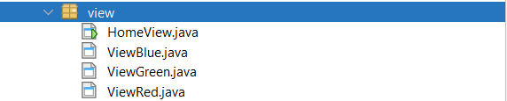
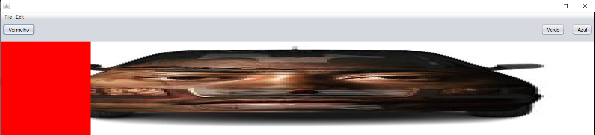

# Aula 11/04/25

Este documento descreve como implementar a troca de telas utilizando o **JDesktopPane** no NetBeans. Toda a lógica para gerenciar os diferentes painéis (representados pelas janelas internas) é centralizada na classe `ViewController.java`.

---

## 🏗️ Estrutura Base do Projeto



Na estrutura apresentada, o _JFrame_ possui um **Desktop Pane**, que servirá para adicionar as janelas internas.

A aparência final do _JFrame_ é semelhante a:



> Foi adicionado um `Desktop Pane` para o gerenciamento das janelas internas.

---

## 🔄 Reformulação dos Nomes das Telas

Os nomes dos arquivos das telas foram alterados para `ViewCor`. Conforme ilustrado abaixo:



> O nome dos arquivos das telas não interfere na funcionalidade, bastando atenção no momento da importação no controlador.

---

## 🖥️ Código do Controlador (ViewController)

A seguir, apresenta-se o código da classe `ViewController` com comentários explicativos:

```java
// Classe que controla quais janelas internas (views) serão exibidas
// dentro de um JDesktopPane em uma aplicação Swing.
public class ViewController {

    // Área principal da interface onde as janelas internas são exibidas.
    private JDesktopPane jDesktopPane;

    // Construtor que recebe o JDesktopPane para controle das views.
    public ViewController(JDesktopPane jDesktopPane) {
        this.jDesktopPane = jDesktopPane;
    }

    // Exibe a janela interna "vermelha" (ViewRed).
    public void viewRed() {
        jDesktopPane.removeAll();                // Remove todas as janelas internas atuais.
        jDesktopPane.updateUI();                 // Atualiza o layout da interface.
        Dimension size = jDesktopPane.getSize(); // Obtém o tamanho atual do JDesktopPane.
        ViewRed view = new ViewRed();            // Cria uma nova instância da ViewRed.
        view.setSize(size);                      // Ajusta o tamanho da view para ocupar todo o espaço disponível.
        view.setLocation(0, 0);                  // Posiciona a view no canto superior esquerdo.
        jDesktopPane.add(view);                  // Adiciona a view ao JDesktopPane.
        view.setVisible(true);                   // Torna a view visível.
    }

    // Exibe a janela interna "azul" (ViewBlue).
    public void viewBlue() {
        jDesktopPane.removeAll();                // Remove as janelas internas anteriores.
        jDesktopPane.updateUI();                 // Atualiza o painel.
        Dimension size = jDesktopPane.getSize(); // Obtém o tamanho atual do painel.
        ViewBlue view = new ViewBlue();          // Cria uma nova instância da ViewBlue.
        view.setSize(size);                      // Define o tamanho da view para ocupar o espaço do desktop.
        view.setLocation(0, 0);                  // Posiciona a view no canto superior esquerdo.
        jDesktopPane.add(view);                  // Adiciona a view ao JDesktopPane.
        view.setVisible(true);                   // Torna a view visível.
    }

    // Exibe a janela interna "verde" (ViewGreen).
    public void viewGreen() {
        jDesktopPane.removeAll();                // Remove as views anteriores.
        jDesktopPane.updateUI();                 // Atualiza o visual do desktop.
        Dimension size = jDesktopPane.getSize(); // Obtém o tamanho do JDesktopPane.
        ViewGreen view = new ViewGreen();        // Cria uma nova instância da ViewGreen.
        view.setSize(size);                      // Define o tamanho da view para ocupar toda a área do desktop.
        view.setLocation(0, 0);                  // Posiciona a view no canto superior esquerdo.
        jDesktopPane.add(view);                  // Adiciona a view ao painel.
        view.setVisible(true);                   // Torna a view visível.
    }
}
```

---

## 🌄 Definindo uma Imagem de Fundo no JDesktopPane

Para definir uma imagem de fundo no **JDesktopPane**, proceda conforme indicado a seguir:

1. No modo visual do NetBeans, clique com o botão direito no _JDesktopPane_.
2. Selecione **Properties** e, na aba **Code**, acesse o campo **Custom Creation Code**.
3. Insira o código abaixo:

```java
new JDesktopPane() {
    // Declaração da imagem de fundo.
    private BufferedImage backgroundImage;

    // Bloco de inicialização que carrega a imagem.
    {
        try {
            backgroundImage = javax.imageio.ImageIO.read(getClass().getResource("/img/fundo.jpg"));
        } catch (IOException e) {
            e.printStackTrace();
        }
    }

    // Sobrescrita do método paintComponent para desenhar a imagem de fundo.
    @Override
    protected void paintComponent(Graphics g) {
        super.paintComponent(g);
        if (backgroundImage != null) {
            // Desenha a imagem de fundo estendida para ocupar toda a área do JDesktopPane.
            g.drawImage(backgroundImage, 0, 0, getWidth(), getHeight(), this);
        }
    }
}
```

> A imagem `fundo.jpg` deve estar localizada na pasta `src/img/`.  
> O caminho `/img/fundo.jpg` deve corresponder à estrutura de pacotes do projeto.

Em caso de erros de importação, utilize as sugestões automáticas do NetBeans (ícones de lâmpada) para resolver as dependências.

---

## ✅ Finalização

Para finalizar a implementação, integre o controlador na tela principal. Na classe responsável pela tela inicial (por exemplo, `HomeView`), declare uma variável do tipo `ViewController`, realize sua inicialização e invoque o método apropriado (viewRed, viewBlue ou viewGreen) conforme o botão acionado.  
Adicionalmente, é recomendável alterar a cor de fundo dos _JPanels_ para que a troca de telas seja visualmente consistente.

O projeto completo pode ser baixado neste link: [Rgb.zip](Projects/Rgb.zip).



---

## ⚠️ Observação

Este material foi elaborado de forma independente a partir do conteúdo teórico apresentado em aula, sem a participação direta do docente na elaboração deste documento.
