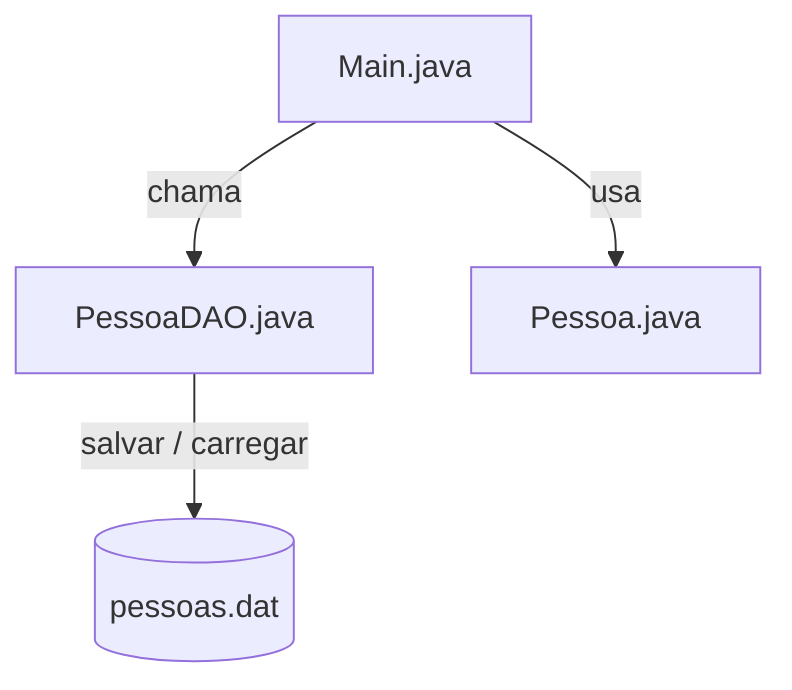

# **Persistência de Dados - JAVA**

Existem várias maneiras de persistir (salvar) dados em Java! Vamos começar com uma abordagem clássica: **arquivos `.dat`** usando **serialização**.

---

## **.dat - O que é isso?**

Um arquivo `.dat` é um arquivo **binário**, usado para armazenar dados de forma compacta e não legível por humanos. Em Java, é muito comum usar `.dat` para **salvar objetos completos**, preservando seus atributos.

---

## **Pra que serve?**

Serve para persistir **objetos Java** e suas informações de forma fácil, sem precisar usar banco de dados ou formatos como JSON ou XML. Basicamente, você pega uma lista, um objeto, e joga tudo dentro do arquivo.

---

## **Quando usar?**

- Quando precisa **salvar e recuperar objetos exatamente como estão**.
- Em projetos pequenos ou simples, onde um banco de dados seria exagero.
- Quando não é necessário editar os dados manualmente (porque o arquivo não é legível).

---

## **Como funciona na prática?**

A ideia é simples:

- Sua classe precisa implementar `Serializable`.
- Usa-se `ObjectOutputStream` para gravar no arquivo e `ObjectInputStream` para ler.
- Toda vez que quiser salvar, você grava a **lista inteira** de objetos no arquivo.

---

Veja os exemplos abaixo:

---

### **Classe Pessoa**

Arquivo: [Pessoa.java](dat/Pessoa.java)

```java
import java.io.Serializable;

// Classe simples, mas com Serializable para permitir salvar no arquivo binário
public class Pessoa implements Serializable {
    private static final long serialVersionUID = 1L;
    private String nome;
    private int idade;

    public Pessoa(String nome, int idade) {
        this.nome = nome;
        this.idade = idade;
    }

    public String getNome() { return nome; }
    public void setNome(String nome) { this.nome = nome; }

    public int getIdade() { return idade; }
    public void setIdade(int idade) { this.idade = idade; }

    @Override
    public String toString() {
        return nome + " (" + idade + ")";
    }
}
```

---

### **Classe responsável por salvar e carregar os dados**

Arquivo: [PessoaDAO.java](dat/PessoaDAO.java)

```java
import java.io.*;
import java.util.ArrayList;
import java.util.List;

public class PessoaDAO {
    private static final String ARQUIVO = "pessoas.dat";

    // Carregar lista do arquivo .dat
    public static List<Pessoa> carregar() {
        try (ObjectInputStream ois = new ObjectInputStream(new FileInputStream(ARQUIVO))) {
            return (List<Pessoa>) ois.readObject();
        } catch (FileNotFoundException e) {
            return new ArrayList<>(); // Se não existir, retorna lista vazia
        } catch (IOException | ClassNotFoundException e) {
            e.printStackTrace();
            return new ArrayList<>();
        }
    }

    // Salvar lista no arquivo .dat
    public static void salvar(List<Pessoa> pessoas) {
        try (ObjectOutputStream oos = new ObjectOutputStream(new FileOutputStream(ARQUIVO))) {
            oos.writeObject(pessoas);
        } catch (IOException e) {
            e.printStackTrace();
        }
    }
}
```

---

### **Exemplo de uso**

Arquivo: [Main.java](dat/Main.java)

```java
import java.util.List;

public class Main {
    public static void main(String[] args) {
        // Carrega os dados já salvos
        List<Pessoa> pessoas = PessoaDAO.carregar();

        // Adiciona novas pessoas
        pessoas.add(new Pessoa("Diego", 20));
        pessoas.add(new Pessoa("Maria", 22));

        // Salva tudo novamente
        PessoaDAO.salvar(pessoas);

        // Exibe as pessoas salvas
        System.out.println("Pessoas salvas:");
        pessoas.forEach(System.out::println);
    }
}
```

---

### **Estrutura do projeto**

```
dat/
 ├── Pessoa.java
 ├── PessoaDAO.java
 └── Main.java
```

---

## **Diagrama simples**



---

## **Prós e Contras**

✔ Fácil de implementar

✔ Ótimo para pequenos projetos

✖ Arquivo não é legível por humanos

✖ Alterar a estrutura da classe pode quebrar compatibilidade

---
