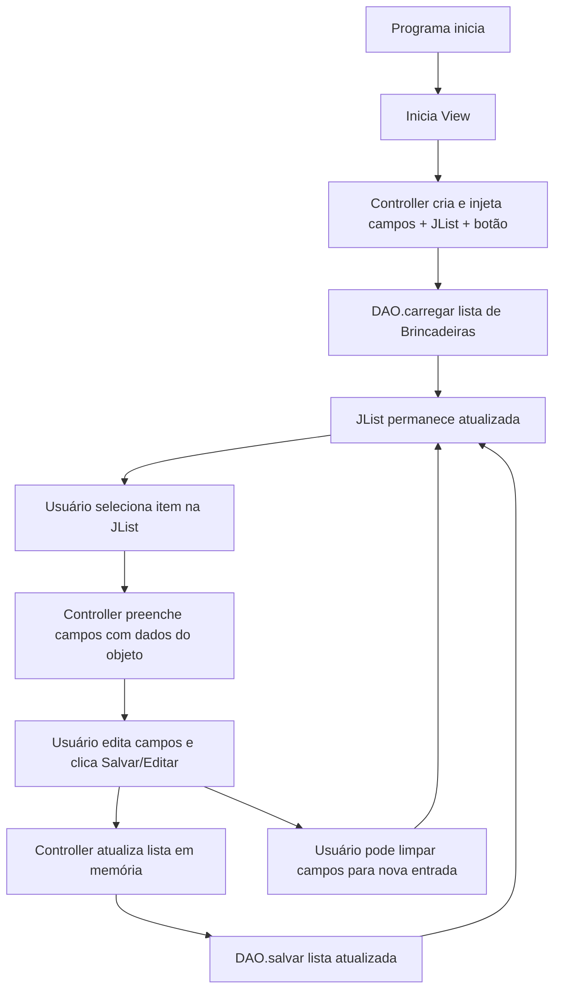

# 🖥️ Java Desktop 

## 1️⃣ Estrutura mínima de arquivos

```
/src
  /modelo
    Brincadeira.java
  /controller
    CBrincadeira.java
  /db
    BrincadeiraDAO.java
  /view
    TBrincadeira.java
```

---

## 2️⃣ Modelo (Brincadeira.java)

```java
package modelo;
import java.io.Serializable;

public class Brincadeira implements Serializable {
    private int id;
    private String nome;
    private String descricao;
    private float valor;

    public Brincadeira(int id, String nome, String descricao, float valor) {
        this.id = id;
        this.nome = nome;
        this.descricao = descricao;
        this.valor = valor;
    }

    public int getId() { return id; }
    public String getNome() { return nome; }
    public String getDescricao() { return descricao; }
    public float getValor() { return valor; }
}
```

---

## 3️⃣ DAO simples (BrincadeiraDAO.java)

```java
package db;
import modelo.Brincadeira;
import java.io.*;
import java.util.ArrayList;
import java.util.List;

public class BrincadeiraDAO {
    private static final String ARQUIVO = "brinquedo.dat";

    public static List<Brincadeira> carregar() {
        try (ObjectInputStream ois = new ObjectInputStream(new FileInputStream(ARQUIVO))) {
            return (List<Brincadeira>) ois.readObject();
        } catch (Exception e) {
            return new ArrayList<>(); // retorna lista vazia se erro
        }
    }

    public static void salvar(List<Brincadeira> lista) {
        try (ObjectOutputStream oos = new ObjectOutputStream(new FileOutputStream(ARQUIVO))) {
            oos.writeObject(lista);
        } catch (IOException e) {
            e.printStackTrace();
        }
    }
}
```

---

## 4️⃣ Controller mínimo (CBrincadeira.java)

```java
package controller;
import modelo.Brincadeira;
import db.BrincadeiraDAO;
import javax.swing.*;
import java.util.ArrayList;

public class CBrincadeira {
    JTextField txtId, txtNome, txtDescricao, txtValor;
    JList<String> jList;
    JButton btnSalvarEditar;
    ArrayList<Brincadeira> lista = new ArrayList<>();
    DefaultListModel<String> model = new DefaultListModel<>();
    int index = 0;

    public CBrincadeira(JTextField txtId, JTextField txtNome, JTextField txtDescricao,
                        JTextField txtValor, JList<String> jList, JButton btnSalvarEditar) {
        this.txtId = txtId;
        this.txtNome = txtNome;
        this.txtDescricao = txtDescricao;
        this.txtValor = txtValor;
        this.jList = jList;
        this.btnSalvarEditar = btnSalvarEditar;
        carregarLista();
    }

    public void cadastrarOuEditar() {
        int id = Integer.parseInt(txtId.getText());
        String nome = txtNome.getText();
        String desc = txtDescricao.getText();
        float val = Float.parseFloat(txtValor.getText());

        Brincadeira b = new Brincadeira(id, nome, desc, val);
        if (btnSalvarEditar.getText().equalsIgnoreCase("Salvar")) {
            lista.add(b);
        } else {
            lista.set(index, b);
        }
        limparCampos();
        BrincadeiraDAO.salvar(lista);
        carregarLista();
    }

    public void carregarLista() {
        lista = new ArrayList<>(BrincadeiraDAO.carregar());
        model.clear();
        for (Brincadeira b : lista) {
            model.addElement(b.getNome() + " - " + b.getId());
        }
        jList.setModel(model);
    }

    public void selecionarObjeto() {
        String sel = jList.getSelectedValue();
        index = 0;
        for (Brincadeira b : lista) {
            if ((b.getNome() + " - " + b.getId()).equals(sel)) {
                txtId.setText(String.valueOf(b.getId()));
                txtNome.setText(b.getNome());
                txtDescricao.setText(b.getDescricao());
                txtValor.setText(String.valueOf(b.getValor()));
                btnSalvarEditar.setText("Editar");
                break;
            }
            index++;
        }
    }

    public void limparCampos() {
        txtId.setText(String.valueOf(lista.size() + 1));
        txtNome.setText("");
        txtDescricao.setText("");
        txtValor.setText("");
        btnSalvarEditar.setText("Salvar");
    }
}
```

---

## 5️⃣ Fluxo visual



---

✅ **Resumo**

- **Modelo:** só guarda dados (id, nome, descrição, valor)
- **DAO:** só lê e escreve lista em arquivo (`brinquedo.dat`)
- **Controller:** conecta lista + campos + botão, carrega, seleciona, edita e salva
- **Fluxo:** clicar na JList → preencher campos → editar → salvar → atualizar lista

---
