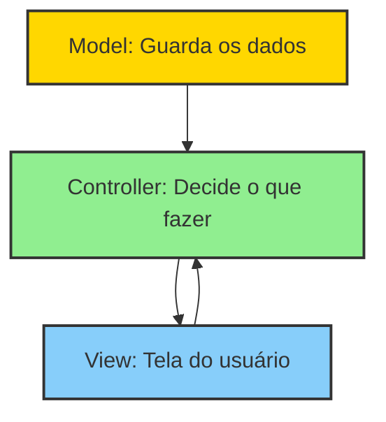
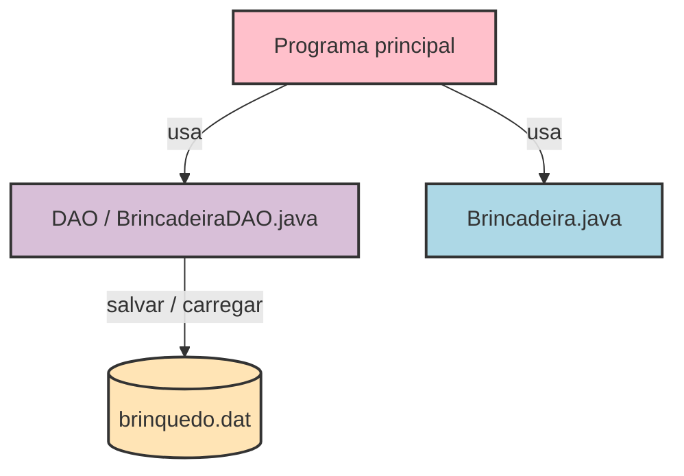
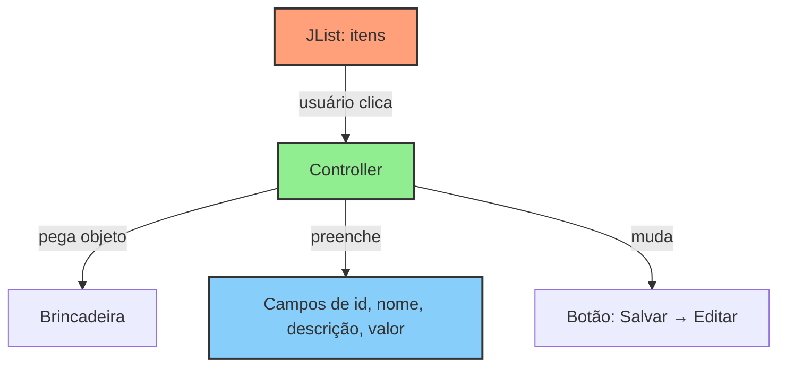
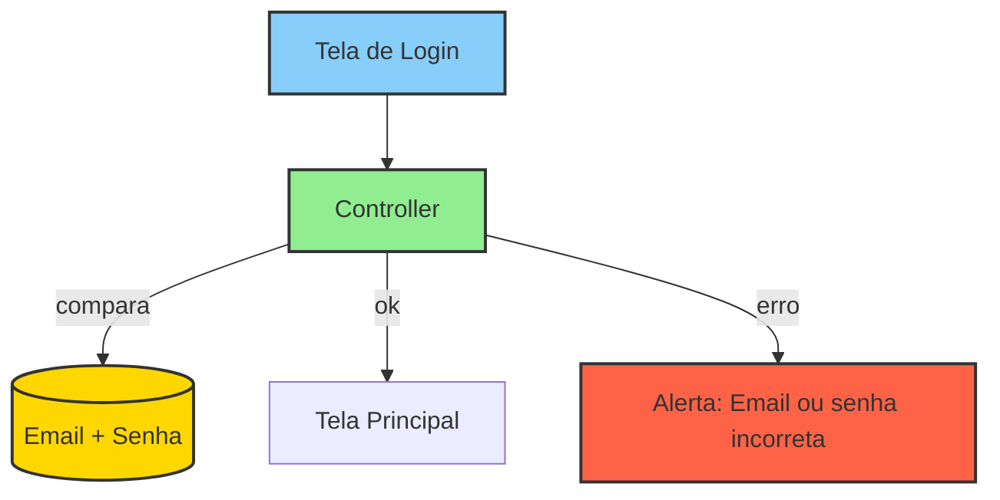
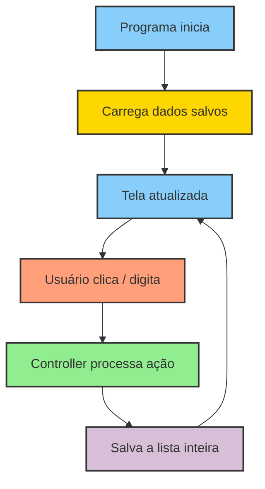

# Resumo Visual — Java Desktop

---

## 1️⃣ Estrutura MVC

- **Model (amarelo):** objetos como Brincadeira, Pessoa, etc.
- **View (azul):** janelas, botões, campos de texto, listas.
- **Controller (verde):** recebe clique, chama Model e atualiza View.

---

## 2️⃣ Fluxo de salvar e carregar dados

- **Salvar:** lista de objetos → arquivo
- **Carregar:** arquivo → lista de objetos

---

## 3️⃣ Seleção de item na lista (JList)

- Clicar seleciona um objeto
- Preenche campos na tela
- Muda botão para “Editar”

---

## 4️⃣ Login simples

- Digitar email/senha → Controller verifica → mostra tela principal ou alerta

---

## 5️⃣ Fluxo geral do programa

- Inicia → carrega dados → usuário interage → controller processa → salva → tela atualizada

---

## ✅ Dicas para prova

- Model = dados, View = tela, Controller = decide e liga tudo
- Salvar toda a lista evita perder informações
- Clicar na lista preenche campos e muda botão
- Login simples = comparar strings
- Alternar telas = remover tudo do JDesktopPane e adicionar novo painel
