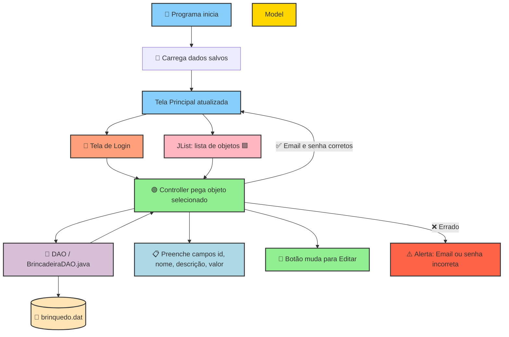

# 🖥️ Java 

---

## 🔹 Legenda

- **💾 DAO / 📂 Arquivo:** onde os dados são salvos e carregados
- **🟢 Controller:** decide tudo e conecta Model + View
- **📝 Login / ⚠️ Mensagem:** simples, didático, compara strings
- **🟦 JList:** clique → seleciona objeto → preenche campos
- **📋 Campos + 🔘 Botão:** interface pronta para editar ou salvar
- **Tela Principal:** exibe a lista e campos para o usuário

---

## 🔹 Fluxo resumido em palavras

1. 🚀 Programa inicia → carrega dados 💾📂
2. 📝 Usuário faz login → ✅ Controller verifica → tela principal ou ⚠️ alerta
3. 🟦 Clicar na lista → 🟢 Controller pega objeto → 📋 campos preenchidos → 🔘 botão vira Editar
4. Alteração → 🟢 Controller salva tudo → 💾 DAO escreve em 📄 arquivo
5. Tela se atualiza automaticamente
