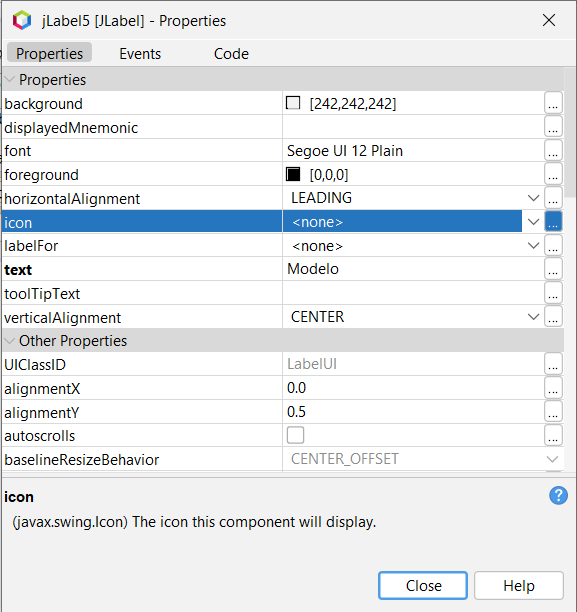

# 📚 Templates

## 🧭 Índice de Navegação

- [JList](#-jlist)
- [Imagens em JLabels](#-imagens)
- [Navegação em JDesktopPane](#-navegação-em-jdesktoppane)
- [Persistência de Dados via Serialização (DAO)](#-persistência-de-dados-via-serialização-padrão-dao)
- [Projetos Exemplos](#projetos-exemplos)

---

## 🚀 JList

### Declaração de Variáveis Necessárias

Estas variáveis devem ser declaradas como membros da sua classe controlador:

```java
// Componentes da Interface Gráfica
private JTextField jTextField01;
private JTextField jTextField02;
private JTextField jTextField03;
private JList<String> jList;

// Modelos de Dados e Visualização
private ArrayList<Modelo> arrayListModelos; // Armazena os objetos reais
private ArrayList<String> arrayListStrings; // Lista intermediária (Strings formatadas)
private DefaultListModel<String> defaultListModel; // Modelo de dados do JList
```

### Inicialização (No Construtor do Controlador)

É **crucial** que todas as listas e o modelo sejam inicializados no construtor.

```java
// Inicialização obrigatória no construtor
defaultListModel = new DefaultListModel<>();
arrayListModelos = new ArrayList<>();
arrayListStrings = new ArrayList<>();
```

### Método `salvar()`

Responsável por coletar os dados, criar um objeto e armazená-lo na lista principal (`ArrayList<Modelo>`).

```java
private void salvar(){
    // Coleta os dados dos campos de texto
    String atributo01 = jTextField01.getText();
    String atributo02 = jTextField02.getText();
    String atributo03 = jTextField03.getText();

    // Cria e armazena o novo objeto Modelo
    Modelo newModelo = new Modelo(atributo01, atributo02, atributo03);
    arrayListModelos.add(newModelo);
}
```

### Método `carregar()`

Responsável por atualizar a visualização do `JList` com base nos objetos de `arrayListModelos`. Esta é a parte que converte o objeto `Modelo` em uma `String` exibível.

```java
private void carregar(){
    // Limpa as listas para evitar duplicidade
    defaultListModel.clear();
    arrayListStrings.clear();

    // Percorre a lista de Modelos e gera as Strings formatadas
    for(Modelo m : arrayListModelos){
        // Exemplo de formatação: "A B C"
        String itemFormatado = m.getAtributo01() + " " + m.getAtributo02() + " " + m.getAtributo03();
        arrayListStrings.add(itemFormatado);
    }
    defaultListModel.addAll(arrayListStrings);
    jList.setModel(defaultListModel);
}
```

### Fluxo de Chamadas

Para garantir o correto funcionamento, utilize este fluxo:

| Ação             | Local de Chamada                        | Objetivo                                                  |
| :--------------- | :-------------------------------------- | :-------------------------------------------------------- |
| **`salvar()`**   | No **Listener do Botão de Cadastro**    | Salvar o objeto.                                          |
| **`carregar()`** | **Após `salvar()`** e no **Construtor** | Recarregar e atualizar o `JList` para exibir o novo item. |

---

## 🖼️ Imagens

Este template demonstra as duas abordagens principais para carregar e exibir imagens em um `JLabel`: via Interface Gráfica (UI) ou diretamente via Código.

### Abordagem via Interface Gráfica (UI)

Neste método, o ícone inicial é definido nas propriedades do componente.

**Exemplo:**



**Observação:** Ao usar esta abordagem, o redimensionamento para o tamanho correto do `JLabel` é obrigatório.

#### Método de Redimensionamento Simples (Via UI)

Este método **redimensiona a imagem** para um tamanho fixo, usando o ícone que _já está carregado_ no `JLabel`.

```java
private void setSizeImage(int width, int height, JLabel jLabelImage) {
    // É crucial verificar se o JLabel possui um ícone para evitar NullPointerException.
    if (jLabelImagem.getIcon() != null) {

        // Obtém a imagem original do ícone (fazendo um cast seguro)
        Image imagem = ((ImageIcon) jLabelImagem.getIcon()).getImage();

        // Redimensiona a imagem, priorizando a qualidade (SCALE_SMOOTH)
        Image novaImagem = imagem.getScaledInstance(width, height, Image.SCALE_SMOOTH);

        // Define o novo ícone redimensionado
        jLabelImagem.setIcon(new ImageIcon(novaImagem));
    }
}
```

### Abordagem via Código

Esta é a abordagem mais **robusta** e **flexível**. Ela carrega a imagem do _classpath_ do projeto e a redimensiona, mantendo a **proporção original** da imagem.

#### Método `setScaledIcon`

```java

private void setScaledIcon(JLabel label, String imagePath, int maxWidth, int maxHeight) {
    // Carrega o ícone usando getResource() para garantir que funcione após o build
    ImageIcon originalIcon = new ImageIcon(getClass().getResource(imagePath));

    Image img = originalIcon.getImage();
    int width = img.getWidth(null);
    int height = img.getHeight(null);

    // Calcula a proporção de redimensionamento (o menor ratio garante que a imagem caiba)
    double widthRatio = (double) maxWidth / width;
    double heightRatio = (double) maxHeight / height;
    double ratio = Math.min(widthRatio, heightRatio);

    // Calcula as novas dimensões
    int newWidth = (int) (width * ratio);
    int newHeight = (int) (height * ratio);

    // Redimensiona e define o ícone no JLabel
    Image resizedImg = img.getScaledInstance(newWidth, newHeight, Image.SCALE_SMOOTH);
    ImageIcon resizedIcon = new ImageIcon(resizedImg);

    label.setIcon(resizedIcon);
    // Centraliza a imagem no JLabel
    label.setHorizontalAlignment(JLabel.CENTER);
    label.setVerticalAlignment(JLabel.CENTER);
}
```

#### Exemplo de Uso

```java
// Redimensiona as imagens para caberem no máximo 290x200 pixels
setScaledIcon(lblGameImage, "/resources/images/game.png", 290, 200);
setScaledIcon(lblRankImage, "/resources/images/rank.png", 290, 200);
```

### Boas Práticas e Organização

| Item                       | Observação                                                                                                                                                                                                                  |
| :------------------------- | :-------------------------------------------------------------------------------------------------------------------------------------------------------------------------------------------------------------------------- |
| **Localização da Imagem**  | Para o `getClass().getResource()` funcionar, a imagem deve estar dentro do **classpath**. Recomenda-se usar uma pasta como `resources/images/` na raiz do seu código-fonte.                                                 |
| **Onde Colocar o Código?** | Por se tratar de manipulação direta de UI, o método deve ser colocado na **View** (sua classe `JFrame` ou `JPanel`).                                                                                                        |
| **Uso em Casos Dinâmicos** | Se as imagens mudarem constantemente (ex: carregadas de um banco de dados), o **caminho da imagem** deve ser gerenciado no **Controlador**, mas o método de redimensionamento (`setScaledIcon`) em si continua na **View**. |

---

## 🚀 Navegação em JDesktopPane

Quando um painel de menu precisa mudar o conteúdo de um `JDesktopPane` que atua como container principal, a solução mais prática é **injetar a referência** do `JDesktopPane` no **Controlador** do menu.

### Fluxo na View (Injeção da Referência)

A View (o `Painel` do menu) recebe a referência do container principal (`JDesktopPane`) e a transfere imediatamente para o Controlador.

**Classe `Painel` (View do Menu)**

```java
// Variável do Controlador
Controlador c;

// O Painel recebe o JDesktopPane no construtor
public Painel(JDesktopPane jDesktopPane) {
    initComponents();
    start(jDesktopPane);
}

private void start(JDesktopPane jDesktopPane) {
    // O Controlador é criado e injeta a referência
    c = new Controlador(jDesktopPane);
}
```

### Lógica de Transição (No Controlador)

O Controlador armazena o `JDesktopPane` e executa a lógica de substituição completa do painel, garantindo que a nova tela ocupe todo o espaço disponível.

**Classe `Controlador`**

```java
// Variável para armazenar o container
private JDesktopPane desktopPane;

public Controlador(JDesktopPane jDesktopPane) {
    this.desktopPane = jDesktopPane;
}

public void mudarTela() {
    desktopPane.removeAll();
    View novaView = new View(); // 'View' é o nome do seu novo Painel.
    Dimension size = desktopPane.getSize();
    novaView.setSize(size);
    novaView.setLocation(0, 0);
    desktopPane.add(novaView);
    novaView.setVisible(true);
    desktopPane.revalidate();
    desktopPane.repaint();
}
```

---

## 💾 Persistência de Dados via Serialização (Padrão DAO)

Existem diversas maneiras de persistir (salvar) dados em Java. Para projetos de desktop que não exigem um banco de dados completo, a **serialização** é uma solução simples e eficaz.

A **serialização** é o processo de converter um objeto complexo em memória (`List<Modelo>`) para uma sequência de _bytes_, que pode ser salva em um arquivo (`.dat`). O processo inverso é chamado de desserialização (`load()`).

### Requisito Chave: O Modelo Precisa Ser Serializável

Para que a serialização funcione, sua classe de modelo (`Modelo`) **DEVE** implementar a interface `Serializable`.

```java
public class Modelo implements Serializable {
    // ... seus atributos e métodos ...
}
```

### Implementação DAO (Data Access Object)

O padrão DAO encapsula a lógica de leitura e escrita de dados.

**Classe `ExemploDAO`**

```java
public class ExemploDAO {

    private static final String filePath = "db/arquivo.dat";

    public List<Modelo> load() {
        File file = new File(filePath);

        // Verifica se o arquivo existe. Se não, retorna uma lista vazia.
        if (!file.exists()) {
            return new ArrayList<>();
        }

        try (ObjectInputStream ois = new ObjectInputStream(new FileInputStream(file))) {
            // Desserializa o objeto (List<Modelo>) e faz o cast
            return (List<Modelo>) ois.readObject();
        } catch (Exception e) {
            // Recomenda-se logar o erro, mas retornar uma lista vazia mantém o programa funcional.
            System.err.println("Erro ao carregar dados: " + e.getMessage());
            return new ArrayList<>();
        }
    }

    public static void save(List<Modelo> modeloList) {
        try {
            File file = new File(filePath);
            File parent = file.getParentFile();

            // Garante que o diretório "db/" exista
            if (parent != null && !parent.exists()) {
                parent.mkdirs();
            }

            // Garante que o arquivo exista
            if (!file.exists()) {
                file.createNewFile();
            }

            // Abre o stream e serializa a lista
            try (ObjectOutputStream oos = new ObjectOutputStream(new FileOutputStream(file))) {
                oos.writeObject(modeloList);
            }
        } catch (Exception e) {
            System.err.println("Erro ao salvar dados: " + e.getMessage());
        }
    }
}
```

### Por Que Usar `static`?

O uso dos métodos `static` (`ExemploDAO.load()` e `ExemploDAO.save()`) **facilita a chamada** em todo o código, eliminando a necessidade de criar uma instância do DAO.

### Fluxo de Chamadas no Controlador

Seu Controlador deve usar esses métodos para iniciar e finalizar a aplicação:

| Ação no Controlador | Momento da Chamada                        | Método DAO Utilizado                    |
| :------------------ | :---------------------------------------- | :-------------------------------------- |
| **Inicialização**   | Construtor do Controlador                 | `arrayListModelos = ExemploDAO.load();` |
| **Finalização**     | Fechamento do `JFrame` (`WindowListener`) | `ExemploDAO.save(arrayListModelos);`    |
| **Operação**        | Após `salvar()` ou `editar()`             | `ExemploDAO.save(arrayListModelos);`    |

## Projetos Exemplos

Em breve.
