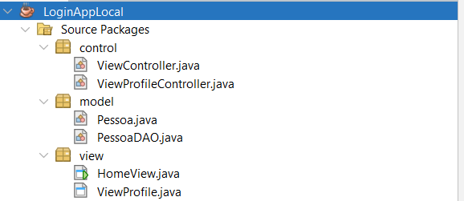

# 📝 Aplicativo de Registro Local

Este projeto é um simples sistema de login feito em Java, com salvamento local de dados usando serialização em arquivos `.dat`.

---

## 📦 Classe de Persistência de Dados

A classe `PessoaDAO` é responsável por **salvar** e **carregar** os dados das pessoas cadastradas no sistema. Os dados são armazenados localmente em um arquivo chamado `registros.dat`, utilizando **serialização de objetos** em Java.

### 📄 `PessoaDAO.java`

```java
public class PessoaDAO {
    private static final String ARQUIVO = "registros.dat";

    // Salva a lista de pessoas no arquivo .dat
    public static void salvarLista(List<Pessoa> pessoas) {
        try (ObjectOutputStream oos = new ObjectOutputStream(new FileOutputStream(ARQUIVO))) {
            oos.writeObject(pessoas);
        } catch (IOException e) {
            e.printStackTrace();
        }
    }

    // Carrega a lista de pessoas do arquivo .dat
    public static List<Pessoa> carregarLista() {
        File file = new File(ARQUIVO);
        if (!file.exists()) return new ArrayList<>();

        try (ObjectInputStream ois = new ObjectInputStream(new FileInputStream(file))) {
            return (List<Pessoa>) ois.readObject();
        } catch (IOException | ClassNotFoundException e) {
            e.printStackTrace();
            return new ArrayList<>();
        }
    }
}
```

> 💡 **Aprendizado**: **Serialização de objetos** permite converter objetos em um formato binário, que pode ser salvo em arquivos e carregado novamente. O formato `.dat` é um arquivo binário que armazena esses dados de forma compacta e rápida, ideal para persistência de objetos em sistemas locais.

---

## 🔎 O que é um Arquivo `.dat`?

O arquivo `.dat` é um arquivo binário utilizado para armazenar dados de forma compacta. No contexto deste projeto, ele armazena a **serialização** de objetos Java. A serialização é o processo de converter um objeto em uma sequência de bytes para que ele possa ser facilmente armazenado em um arquivo ou transmitido pela rede.

- **Vantagens**: O formato binário permite que os dados sejam armazenados de forma mais eficiente e rápida do que arquivos de texto.
- **Desvantagens**: O arquivo `.dat` não é legível por humanos, já que contém dados em formato binário.

A serialização é feita por meio das classes `ObjectOutputStream` e `ObjectInputStream`, que permitem salvar e carregar objetos em Java.

---

## 🧱 Estrutura do Projeto

Abaixo, a estrutura visual do projeto para facilitar a compreensão da organização dos arquivos e pastas:



---

## 🚀 Instruções

### Pré-requisitos

- JDK 23 ou superior instalado.

### Como Rodar o Projeto

1. **Baixe o arquivo executável `.jar`** ou **extraia o conteúdo do arquivo `.zip`**.
2. Se você baixou o `.jar`, basta executá-lo diretamente com um clique duplo (ou via terminal).
3. Se você extraiu o `.zip`, abra o projeto em sua IDE de preferência e execute a classe principal.

---

## 🏅 Créditos

Desenvolvido por **Diego**.

---

## 🚀 Baixe e Teste!

Você pode baixar e testar o aplicativo com os arquivos abaixo:

- 📦 Arquivo executável: [LoginAppLocal.jar](LoginAppLocal.jar)
- 🗂️ Código fonte compactado: [LoginAppLocal.zip](LoginAppLocal.zip)
