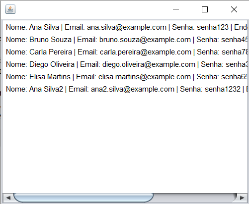

# WebSockets

## O que é?

WebSocket é um protocolo que permite comunicação **bidirecional e contínua** entre cliente e servidor. Diferente do protocolo HTTP, que é baseado em requisição e resposta, o WebSocket mantém a conexão aberta para enviar e receber dados em tempo real, proporcionando comunicação mais rápida e eficiente.

---

## Para que utilizar?

* Em aplicações que demandam **atualização instantânea** dos dados, como chats, jogos online, sistemas de monitoramento, etc.
* Para evitar múltiplas requisições HTTP que podem sobrecarregar a rede e o servidor.
* Para garantir comunicação persistente e em tempo real entre cliente e servidor.

---

## Exemplo: Controller Java que usa WebSocket para atualizar uma lista de pessoas

```java
package app;

import jakarta.websocket.ContainerProvider;
import jakarta.websocket.WebSocketContainer;
import model.Pessoa;
import websocket.MeuClienteWebSocket;

import javax.swing.DefaultListModel;
import java.net.URI;
import java.util.List;

public class PessoaController {

    private List<Pessoa> listaPessoas;
    private MeuClienteWebSocket clienteWebSocket;

    public PessoaController(String websocketURI) {
        try {
            WebSocketContainer container = ContainerProvider.getWebSocketContainer();
            clienteWebSocket = new MeuClienteWebSocket();
            container.connectToServer(clienteWebSocket, new URI(websocketURI));
        } catch (Exception e) {
            e.printStackTrace();
        }
    }

    /**
     * Atualiza a lista de pessoas com os dados recebidos via WebSocket.
     * Deve ser chamado periodicamente ou acionado por evento.
     */
    public void atualizarLista() {
        List<Pessoa> novasPessoas = clienteWebSocket.getListaPessoas();
        if (novasPessoas != null) {
            this.listaPessoas = novasPessoas;
        }
    }

    /**
     * Converte a lista de pessoas para um modelo compatível com JList do Swing.
     */
    public DefaultListModel<String> getDefaultListModel() {
        DefaultListModel<String> model = new DefaultListModel<>();
        if (listaPessoas != null) {
            for (Pessoa p : listaPessoas) {
                String linha = String.format("Nome: %s | Email: %s | Senha: %s | Endereço: %s",
                        p.getNome(), p.getEmail(), p.getSenha(), p.getEndereco());
                model.addElement(linha);
            }
        }
        return model;
    }

    /**
     * Limpa a lista de pessoas.
     */
    public void limparLista() {
        if (listaPessoas != null) {
            listaPessoas.clear();
        }
    }
}
```

---

## Modelo de dados: classe Pessoa

```java
package model;

public class Pessoa {
    private int id;
    private String nome;
    private String email;
    private String senha;
    private String endereco;

    public Pessoa() {}

    public Pessoa(int id, String nome, String email, String senha, String endereco) {
        this.id = id;
        this.nome = nome;
        this.email = email;
        this.senha = senha;
        this.endereco = endereco;
    }

    // Getters e setters
    public int getId() { return id; }
    public void setId(int id) { this.id = id; }

    public String getNome() { return nome; }
    public void setNome(String nome) { this.nome = nome; }

    public String getEmail() { return email; }
    public void setEmail(String email) { this.email = email; }

    public String getSenha() { return senha; }
    public void setSenha(String senha) { this.senha = senha; }

    public String getEndereco() { return endereco; }
    public void setEndereco(String endereco) { this.endereco = endereco; }

    @Override
    public String toString() {
        return "Pessoa{id=" + id + ", nome='" + nome + "', email='" + email + "', senha='" + senha + "', endereco='" + endereco + "'}";
    }
}
```

---

## Exemplo visual



*Exemplo da interface mostrando a lista de pessoas.*

> **Dica:** Ajuste o tamanho da janela para garantir boa visualização.

---

[Download do executável](Pessoa04.exe)