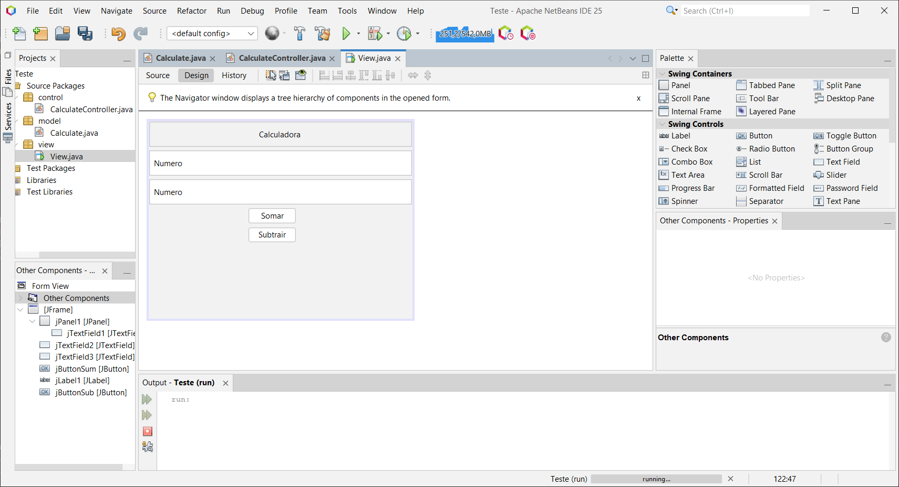
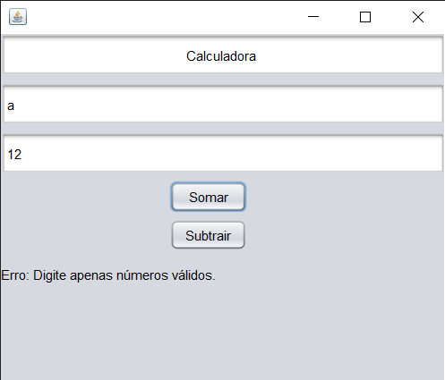
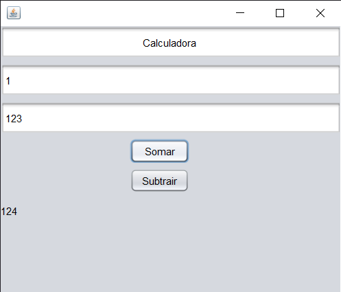

# Calculadora Desenvolvida no Dia 07/03
## Estrutura do Projeto

```plaintext
projeto/
├── model/
│   └── Calculate.java
├── control/
│   └── CalculateController.java
└── view/
    └── View.java
```

---

## Responsabilidades

- **Calculate (model/Calculate.java):**  
  Define o modelo da calculadora, contendo os atributos e métodos para as operações.

- **CalculateController (control/CalculateController.java):**  
  Gerencia as ações do sistema, incluindo a manipulação dos eventos dos botões e a comunicação entre a view e o modelo.

- **View (view/View.java):**  
  Responsável pela interface gráfica do usuário.

---

## Códigos-Fonte

> Confira os detalhes dos códigos na pasta [**/src**](src/).

### Calculate.java

```java
/*
 * Click nbfs://nbhost/SystemFileSystem/Templates/Licenses/license-default.txt to change this license
 * Click nbfs://nbhost/SystemFileSystem/Templates/Classes/Class.java to edit this template
 */
package model;

/**
 *
 * @author Diego
 */
public class Calculate {

    private int a;
    private int b;

    public int getA() {
        return a;
    }

    public void setA(int a) {
        this.a = a;
    }

    public int getB() {
        return b;
    }

    public void setB(int b) {
        this.b = b;
    }

    public Calculate(int a, int b) {
        this.a = a;
        this.b = b;
    }

    public Calculate() {
    }

    public int sum() {
        return this.a + this.b;
    }

    public int sub() {
        return this.a - this.b;
    }
}
```

### CalculateController.java

```java
package control;

import javax.swing.JButton;
import javax.swing.JLabel;
import javax.swing.JTextField;
import model.Calculate;

public class CalculateController {

    private JTextField jTextFieldNumberA;
    private JTextField jTextFieldNumberB;
    private JButton jButtonSum;
    private JButton jButtonSub;
    private JLabel jLabelResponse;

    public CalculateController(JTextField jTextFieldNumberA, JTextField jTextFieldNumberB, JButton jButtonSum, JButton jButtonSub, JLabel jLabelResponse) {
        this.jTextFieldNumberA = jTextFieldNumberA;
        this.jTextFieldNumberB = jTextFieldNumberB;
        this.jButtonSum = jButtonSum;
        this.jButtonSub = jButtonSub;
        this.jLabelResponse = jLabelResponse;

        // Adicionar eventos de ação para os botões
        this.jButtonSum.addActionListener(e -> sum()); // Ação para soma
        this.jButtonSub.addActionListener(e -> sub()); // Ação para subtração
    }

    // Método para obter os números dos campos de texto
    private Calculate createCalculate() {
        int numberA = 0;
        int numberB = 0;
        try {
            numberA = Integer.parseInt(jTextFieldNumberA.getText());
            numberB = Integer.parseInt(jTextFieldNumberB.getText());
        } catch (NumberFormatException ex) {
            jLabelResponse.setText("Erro: Digite apenas números válidos.");
            return null;
        }
        return new Calculate(numberA, numberB);
    }

    // Método para realizar a soma
    public void sum() {
        Calculate calc = createCalculate();
        if (calc != null) {
            String result = String.valueOf(calc.sum());
            jLabelResponse.setText(result);
        }
    }

    // Método para realizar a subtração
    public void sub() {
        Calculate calc = createCalculate();
        if (calc != null) {
            String result = String.valueOf(calc.sub());
            jLabelResponse.setText(result);
        }
    }

    public CalculateController() {
    }
}
```

> **Observação:** Este arquivo (CalculateController.java) contém as implementações que mais trouxeram novidades pra mim.

### View

A interface gráfica foi desenvolvida para ser simples e intuitiva. Abaixo, seguem alguns exemplos ilustrativos do funcionamento do sistema:

- **Tela Inicial:**

  

- **Mensagem de Erro:**  
  Exibida após a inserção de valores inválidos.  
  

- **Resultado da Soma:**  
  Exibida após inserir valores corretos e acionar a operação de soma.  
  

- **Resultado da Subtração:**  
  Exibida após inserir valores corretos e acionar a operação de subtração.  
  

---

## Execução do Programa

**Para executar o programa em sua máquina, basta baixar o arquivo [*Calculate.jar*](dist/Calculate.jar).**

---