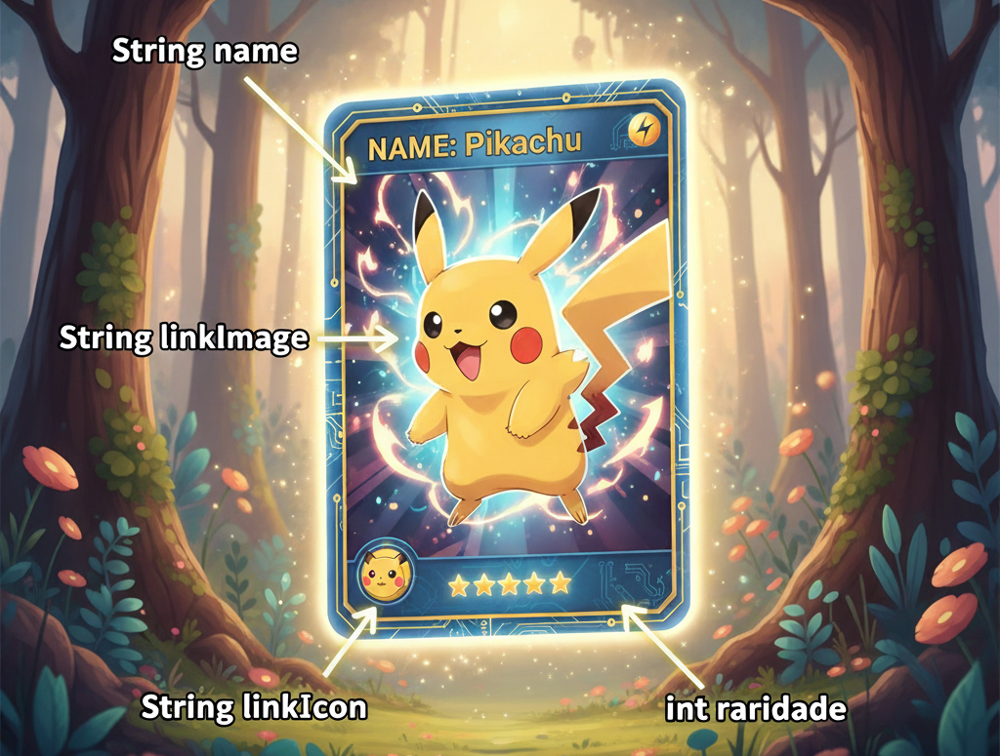
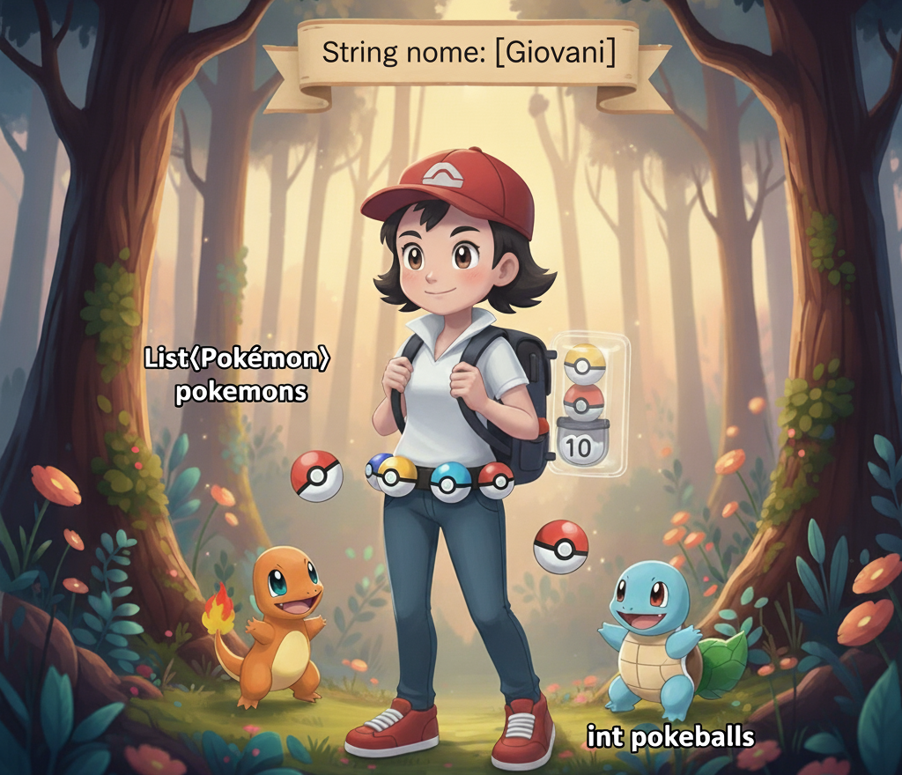
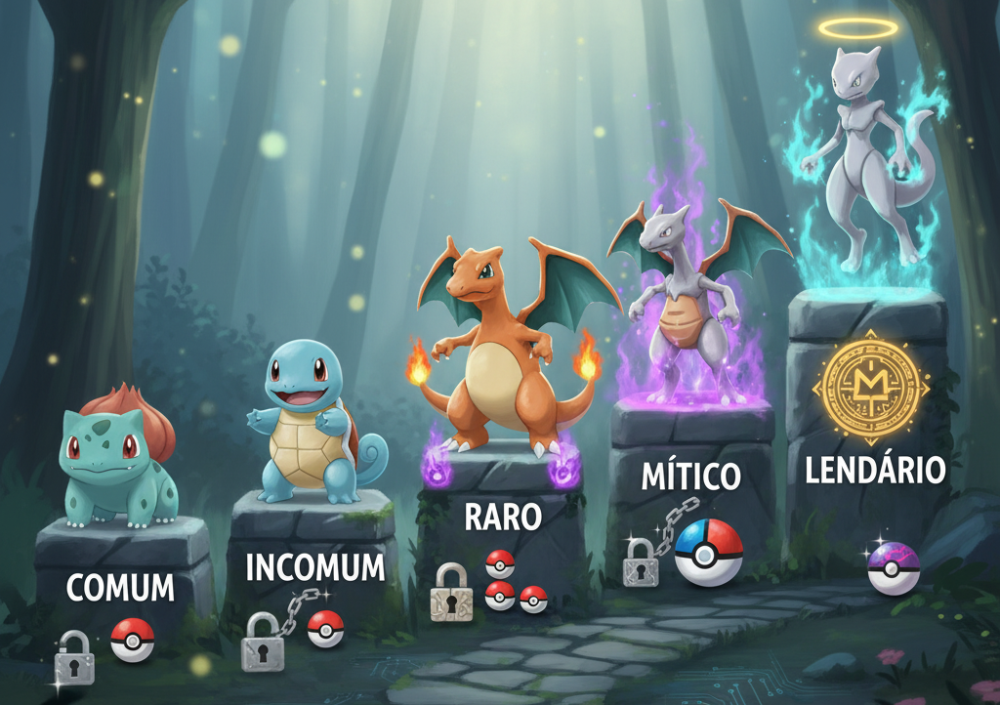

# PokéDraw

Projeto de um jogo casual de captura de Pokémons, com progressão por coleção, economia simples e rankings competitivos.

[](#sumário)
[](#sumário)
[](#changelog)

---

## Sumário

- [PokéDraw](#pokédraw)
  - [Sumário](#sumário)
  - [Visão Geral](#visão-geral)
  - [Mecânicas Principais](#mecânicas-principais)
  - [Conteúdo](#conteúdo)
  - [Leaderboards](#leaderboards)
  - [Roadmap e Cronograma](#roadmap-e-cronograma)
  - [Arquitetura e Camadas](#arquitetura-e-camadas)
  - [Estrutura de Dados](#estrutura-de-dados)
    - [Pokemon](#pokemon)
    - [Treinador](#treinador)
    - [Raridade](#raridade)
  - [Controladores](#controladores)
  - [Como Executar](#como-executar)
  - [Imagem das Telas](#imagem-das-telas)
  - [Imagens do Funcionamento](#imagens-do-funcionamento)
  - [Mudanças](#mudanças)
  - [Changelog](#changelog)
  - [Contribuição](#contribuição)

---

## Visão Geral

O PokéDraw é um jogo em que cada rodada apresenta 3 opções de Pokémons. O jogador deve lançar uma Pokébola em um deles. A experiência combina sorte e habilidade:

- Cada Pokémon possui chance própria de captura.
- A pontuação varia por Pokémon e por dificuldade.
- Os Pokémons capturados podem ser vendidos para comprar novas Pokébolas.
- Há rankings competitivo.

Objetivo: maximizar sua coleção, equilibrando risco, recompensa e recursos.

---

## Mecânicas Principais

- Escolha por rodada: 3 Pokémons exibidos, capture 1.
- Chances de captura: definidas por espécie/raridade e tipo de Pokébola.
- Pontuação:
  - Base por espécie/raridade.
  - Multiplicadores por streak, perfeição de jogada ou eventos in-game (a definir).
- Economia:
  - Venda Pokémons repetidos/estratégicos para obter moedas.
- Progressão:
  - Coleção ativa (inventário atual).

---

## Conteúdo

- Primeira versão: 10–100 Pokémons.
- Tipos de Pokébolas: padrão + variações.
- Raridades: Comum, Incomum, Raro, Épico, Lendário.
- Loja simples: compra de Pokébolas; venda de Pokémons da coleção.

---

## Leaderboards

Em breve!

---

## Roadmap e Cronograma

Início: 19/09/2025  
Previsão de término: primeiros 10 dias de novembro

- Semana I: Criação das telas
- Semana II: Organização das estruturas de dados (gerar lista de Pokémons e estruturar dados dos treinadores)
- Semana III: Criação dos modelos e integração dos dados (JSON → objetos Java)
- Semana IV: Mecânica do jogo + controller da tela (regras de negócio)
- Semana V: Aprimoramento do controller + controller dos leaderboards
- Semana VI: Testes e balanceamentos
- Semana VII: Finalização do projeto (hardening, empacotamento e entrega)

Status de cada item será marcado ao longo do desenvolvimento.

---

## Arquitetura e Camadas

Em breve!

---

## Estrutura de Dados

### Pokemon

Gerador: [Pokemons.java](./java/utils/Pokemons.java)

```cmd
Iniciando criação de Pokémons de 1 a 100...
Processo concluído. Total válido: 100
Pok�mons salvos no banco: 100
```

Modelo do Pokemon: [Pokemon.java](./java/model/Pokemon.java)


### Treinador

Modelo: [Treinador.java](./java/model/Treinador.java)


### Raridade

Modelo: [Raridade.java](./java/model/Raridade.java)


---

## Controladores

Em breve!

---

## Como Executar

Em breve!

---

## Imagem das Telas

Em breve!

---

## Imagens do Funcionamento

Em breve!

---

## Mudanças

Possivelmente haverá diversas mudanças ao longo do projeto, mas a ideia é manter o que há na primeira versão deste arquivo como base e refinar de forma incremental.

---

## Changelog

Versão atual: 0.2

- 0.1 – Definição da base (visão geral, arquitetura proposta, cronograma)
- 0.2 - Estruturação dos Dados (Pokemon, Treinador, Raridades)

---

## Contribuição

Em breve!

---
