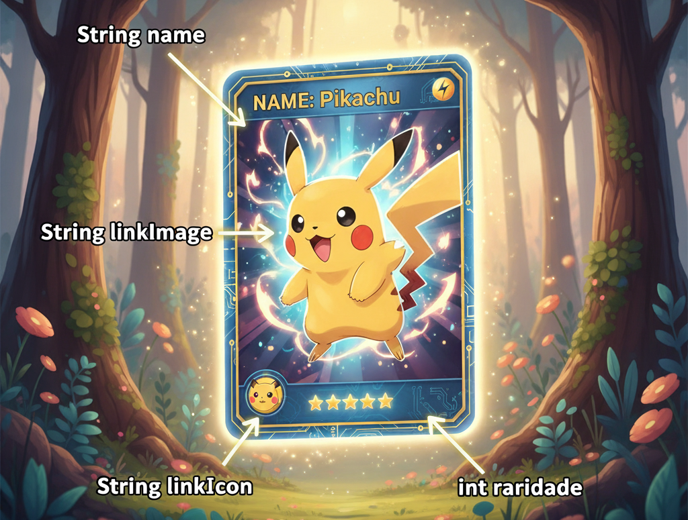
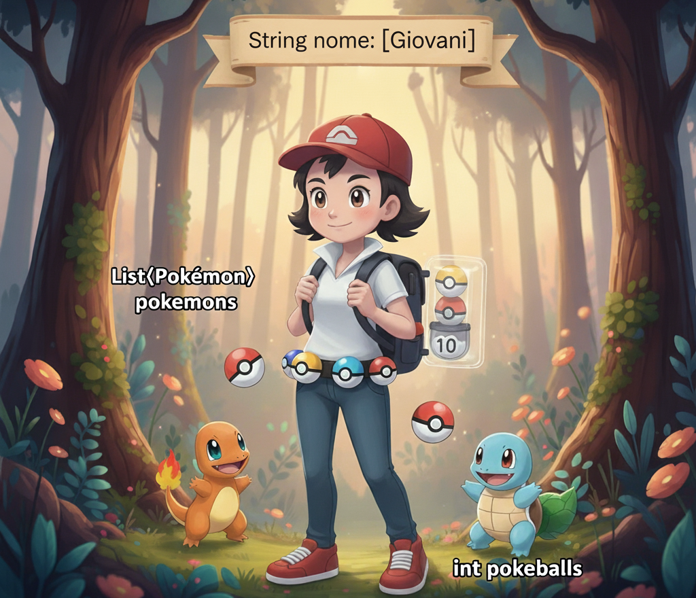
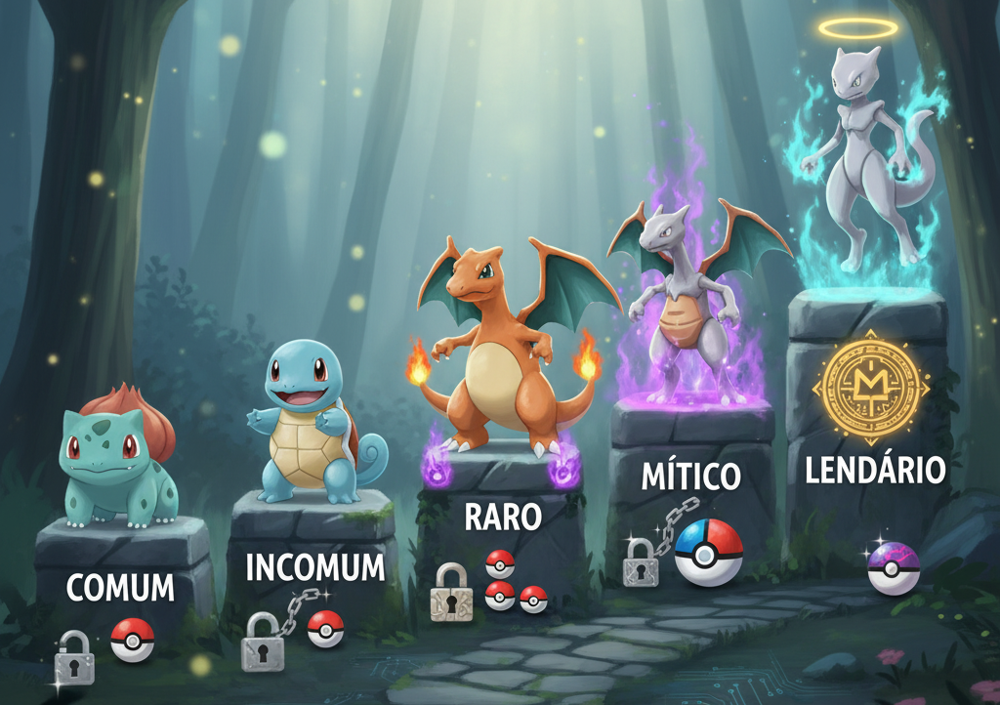
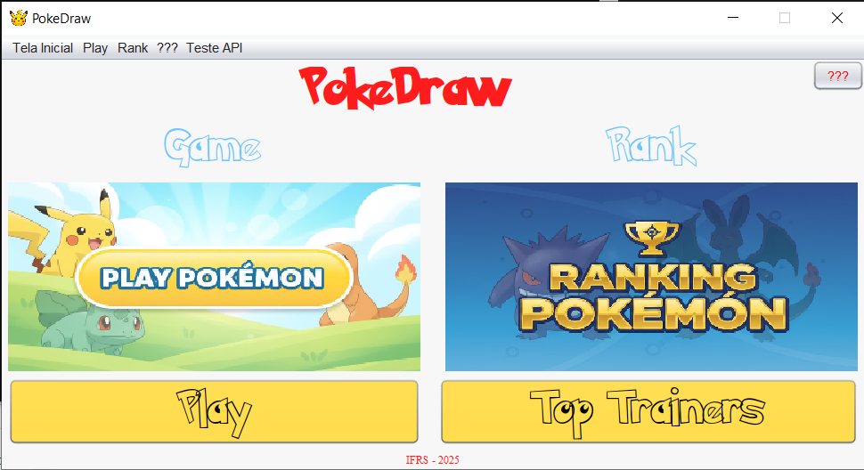
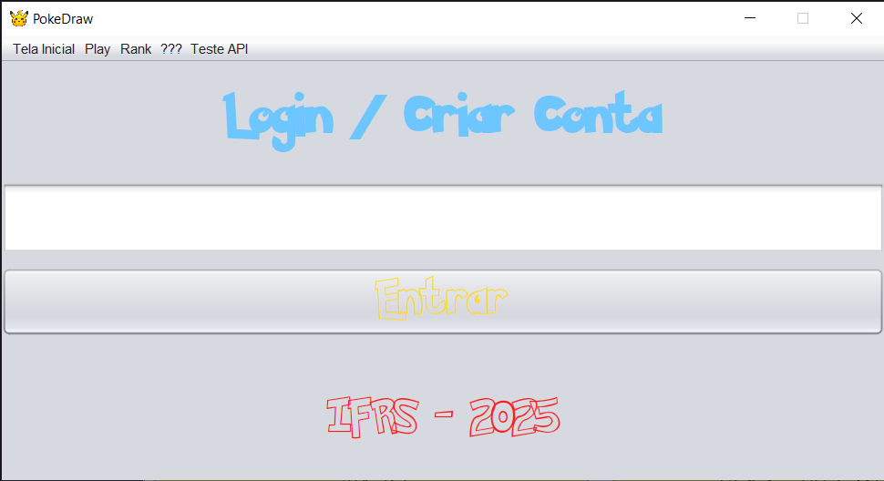
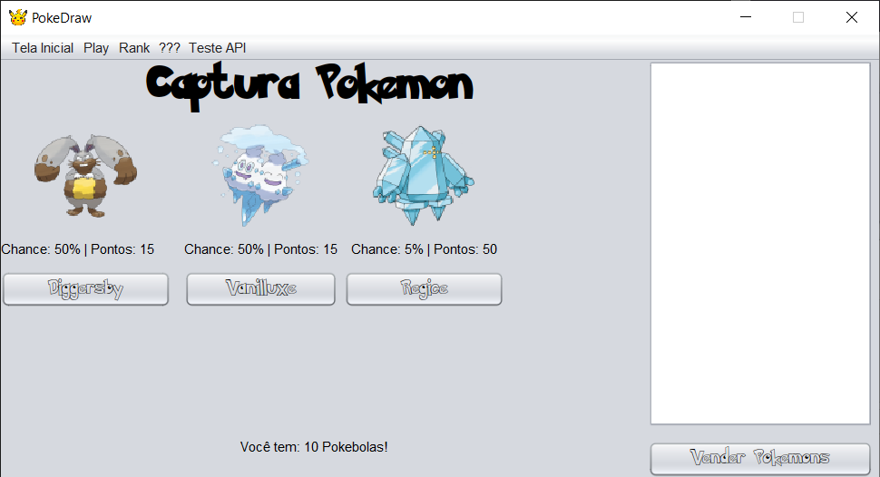
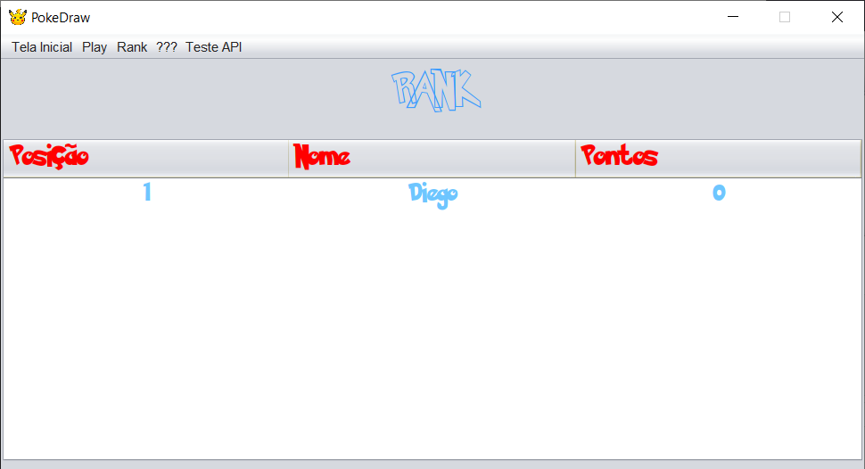
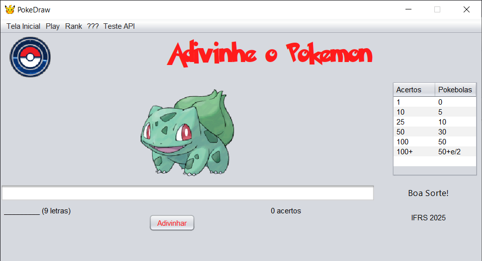

# 🎴 PokéDraw

Projeto de um **jogo casual de captura de Pokémons**, focado em progressão por coleção, economia simplificada e rankings competitivos.
O jogo combina **sorte, estratégia e gerenciamento de recursos**, oferecendo partidas rápidas e rejogáveis.

[](#arquitetura-e-camadas)

---

## 📌 Sumário

- [🎴 PokéDraw](#-pokédraw)
  - [📌 Sumário](#-sumário)
  - [🎮 Visão Geral](#-visão-geral)
  - [🧩 Mecânicas Principais](#-mecânicas-principais)
  - [📦 Conteúdo](#-conteúdo)
  - [🏆 Leaderboards](#-leaderboards)
  - [🗺️ Roadmap e Cronograma](#️-roadmap-e-cronograma)
  - [🏗️ Arquitetura e Camadas](#️-arquitetura-e-camadas)
  - [🗃️ Estrutura de Dados](#️-estrutura-de-dados)
    - [Pokemon](#pokemon)
    - [Treinador](#treinador)
    - [Raridade](#raridade)
  - [🎛️ Controladores](#️-controladores)
  - [▶️ Como Executar](#️-como-executar)
  - [🖼️ Imagens das Telas](#️-imagens-das-telas)

---

## 🎮 Visão Geral

O **PokéDraw** é um jogo baseado em rodadas onde, a cada turno, o jogador recebe **3 opções de Pokémons**.
O objetivo é escolher estrategicamente um deles e tentar capturá-lo, equilibrando risco e recompensa.

Características centrais:

- Cada Pokémon possui **chance própria de captura**
- A **pontuação varia** conforme espécie, raridade e contexto da jogada
- Pokémons capturados podem ser **vendidos** para financiar novas tentativas
- Sistema de **ranking competitivo**

🎯 **Objetivo final:** maximizar sua coleção e pontuação através de decisões inteligentes e boa gestão de recursos.

---

## 🧩 Mecânicas Principais

- **Escolha por rodada**
  A cada rodada, o jogador pode tentar capturar **1 entre 3 Pokémons** exibidos.

- **Chances de captura**

  - Definidas por:

    - Espécie do Pokémon
    - Raridade
    - Tipo de Pokébola utilizada

- **Sistema de Pontuação**

  - Pontuação base por Pokémon
  - Multiplicadores por:

    - Streaks de captura
    - Jogadas perfeitas
    - Eventos in-game _(a definir)_

- **Economia**

  - Venda de Pokémons repetidos ou estratégicos
  - Compra de novas Pokébolas

- **Progressão**

  - Coleção ativa de Pokémons capturados
  - Evolução focada em consistência e eficiência

---

## 📦 Conteúdo

- **Quantidade inicial:** 10–100 Pokémons

- **Tipos de Pokébolas:** padrão + variações

- **Sistema de raridade:**

  - Comum
  - Incomum
  - Raro
  - Épico
  - Lendário

- **Loja básica**

  - Compra de Pokébolas (Automático)
  - Venda de Pokémons da coleção

---

## 🏆 Leaderboards

🔜 Implementação futura.

Os rankings terão foco em:

- Pontuação total
- Eficiência de captura
- Progressão ao longo do tempo

---

## 🗺️ Roadmap e Cronograma

**Início:** 19/09/2025
**Previsão de entrega:** primeiros 10 dias de novembro

| Semana | Atividade                                  |
| ------ | ------------------------------------------ |
| I      | Criação das telas                          |
| II     | Organização das estruturas de dados        |
| III    | Modelos e integração (JSON → objetos Java) |
| IV     | Mecânica principal do jogo                 |
| V      | Controllers avançados e leaderboards       |
| VI     | Testes e balanceamento                     |
| VII    | Finalização, hardening e empacotamento     |

O status de cada etapa será atualizado ao longo do desenvolvimento.

---

## 🏗️ Arquitetura e Camadas

O projeto segue o padrão **MVC (Model–View–Controller)**:

- **Model**
  Representação das entidades e regras de domínio

- **View**
  Camada responsável pela interface gráfica

- **Controller**
  Coordenação da lógica do jogo e fluxo entre Model e View

---

## 🗃️ Estrutura de Dados

### Pokemon

Gerador automático:
📄 [`Pokemons.java`](./java/utils/Pokemons.java)

```text
Iniciando criação de Pokémons de 1 a 100...
Processo concluído. Total válido: 100
Pokémons salvos no banco: 100
```

Modelo:
📄 [`Pokemon.java`](./java/model/Pokemon.java)



---

### Treinador

Modelo responsável pelos dados do jogador:
📄 [`Treinador.java`](./java/model/Treinador.java)



---

### Raridade

Enumeração de raridades e seus modificadores:
📄 [`Raridade.java`](./java/model/Raridade.java)



---

## 🎛️ Controladores

🔜 Em desenvolvimento.

Responsáveis por:

- Controle das rodadas
- Aplicação das regras de captura
- Atualização da economia e pontuação
- Integração com os rankings

---

## ▶️ Como Executar

```bash
java -jar PokeEscolha.jar
```

---

## 🖼️ Imagens das Telas






